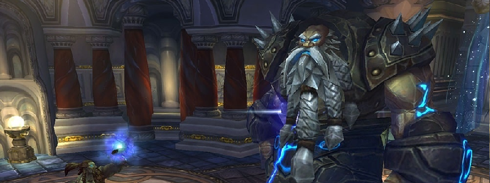

---
tags:
  - "Difficult: Hard"
---

# Assembly of Iron

## Overview

> Hard Mode IC is not quite “enabled” like previous Hard Modes, but instead achieved if Steelbreaker is the last Boss to die.  
> In this case, we’ll kill Stormcaller Brundir -> Runemaster Molgeim -> Steelbreaker. (“Small to Big”)
> <ins>It is assumed you’re aware of all Normal Mode mechanics.</ins>

## Full Mechanics Rundown

* Similarly to Normal Mode, each Boss gains new abilities at each Boss’ death. The order matters greatly though, as you’ll see.
* As Stormcaller Brundir will die first you have not much to worry about him, aside from at least 1 Overload happening before he’ll die, so be ready to move out.

### P1

P1 is identical to Normal Mode.

### P2

Runemaster Molgeim will behave similarly to Normal Mode and the same important mechanics remain: <ins>DPS in Rune of Power, spread for Rune of Death and attempt to dispel Shield of Runes. But differences are also present:</ins>

* Steelbreaker, however, gains a noticeable mechanic: He’ll cast __Static Disruption at the furthest Player from him__. This deals a large amount of Nature damage and further increases the Nature damage taken by the target by 75% per application (it can stack). __This also applies to all other Players in a large radius around the target!__ That Player will ideally be an assigned Healer, usually HPal (who can Bubble the stacks away). <ins>If the soaker has too many stacks, he’ll simply swap with another healer.</ins>
    * This mechanic seems simple at first but can get awry when DPS are spreading for a Rune of Death (thus increasing how far they are from Steelbreaker), or if Steelbreaker is moved (due to a Rune of Death) away from the Raid… The general rule of thumb is that DPS should keep in mind <ins>the closer they are to Steelbreaker (even though Runemaster Molgeim is the kill target), the safer they are from this mechanic.</ins>
* As for Normal Mode, it is ideal to kill Runemaster Molgeim (and begin P3) right after he dropped a Rune of Power. A Stop DPS might be called. __In this case having a fresh rune is nearly mandatory to beat P3.__

### P3

Only Steelbreaker remains, dealing even higher damage with all abilities.

* __His Fusion Punches (which keep happening the whole fight) will be lethal on the tank at this point if he uses no cooldowns or receives no externals.__ He will continue to cast Static Disruption, but soaking it will be much easier since no other movement will be required by the other mechanics.
* __High Voltage__: This ability is actually active since P1, but is irrelevant until P3. Steelbreaker simply deals constant Nature damage to the whole Raid which must be healed through constantly. This should not be a problem if Static Disruptions are properly soaked.
    * __Extreme Caution should be used when using a Soulstone or accepting a BRez during that Phase, as one tick of High Voltage will kill you instantly after rezzing if you receive no Heals.__ Watch a melee DPS’s health bar, wait until they get damaged for 2000-3000 damage, then accept instantly the soulstone/brez and heal yourself if you have a way to.
* __Electrical Charge: Whenever a Player dies in this Phase, Steelbreaker will be healed for 20% HP and will increase all further damage he’ll deal by 25%__. This is extremely dangerous with one Player death, and is a guaranteed wipe at two Player deaths.
    * __Dying instantly after a Soulstone/Brez (see above) means giving not one, but two stacks of this mechanic, basically causing a wipe by yourself.__
* __Overwhelming Power__: Very soon after P3 begins, Steelbreaker will Debuff his current target. The debuff causes the target to deal triple damage, at the cost of dying at the end of the debuff (35 seconds), also killing any nearby Players. When the debuff expires, Steelbreaker repeats the process and Debuffs his current target again. This Phase is thus a huge DPS and healing race to kill Steelbreaker before the guaranteed Player deaths push him out of control.

## Essentials

### Tanks

* Steelbreaker’s Tank must use his cooldowns wisely, as the __Fusion Punches__ in P2 and 3 are lethal or close to. Runemaster Molgeim’s Tank can weave cooldowns when the Boss’ Shield of Runes gets broken (causing him to deal +50% damage)
* P2 Steelbreaker must be <ins>kept close to the stacked Raid as often as possible to ensure he doesn’t Static Disruption the wrong Player.</ins> It must also be ensured Steelbreaker never remains in a Rune of Power for too long.
(Close to the Raid means, in other words, stacked with Runemaster Molgeim)
* <ins>Do not Taunt Steelbreaker back when the Hunter taunts him in P3, until the Debuff has been applied</ins>. If something goes wrong with the debuff and you receive it, __make sure you run out of the Raid (once the second tank took the Boss off you).__

### Healers

* Keep Tanks topped up, as they might take not-so-predictable spikes of damage (Shield of Runes broken, Rune of Power on top of a Boss till he gets moved out, Tank getting hit in the back during movement…) especially as you’ll often have to move and thus heal at lower efficiency.
* __Externals__ will be needed on Steelbreaker’s Tank starting in P3.
* Starting P2, all Healers should be aware of what <ins>Soaking is: Stay the furthest possible from Steelbreaker, range12 away from anyone else, and run back in if you’ve received a stack of Static Disruption. (while ensuring the other Healers know one has to get out and soak in your stead)</ins>
* Extreme Raid Healing will be required in P3 but keep in mind the general rule is that __no one must die, no matter the role/class/spec/gear/importance.__

### DPS

* You will always have to run away from an __Overload__ before Stormcaller Brundir dies.
* Starting at P2 <ins>you should not be the furthest Player from Steelbreaker.</ins> If you find yourself in that situation (like when spreading away for a Rune of Death) simply ensure that you’re not close to other Players, especially when running back in.
* If your class has survivability cooldowns you should save them for P3 as long as they’re not required to prevent your death, of course. Same goes to healthstones.
* __Save DPS cooldowns for P3 as well and be able to stop DPS for the last Rune of Power.__

## Special Assignments

2-3 Healers should be able to <ins>communicate and understand</ins> Static Disruption soaking.  
Heroism is on P3 A.S.A.P, assuming a Rune of Power is there.  
Given the roughness of P3 Healing, a macro-ed Felhunter would be best to remove Fusion Punch and save GCDs on the Healers. Even if a Paladin Tank can self-dispel, the damage dealt by one of his dps GCDs would be worth it given how intense a DPS race P3 is.
