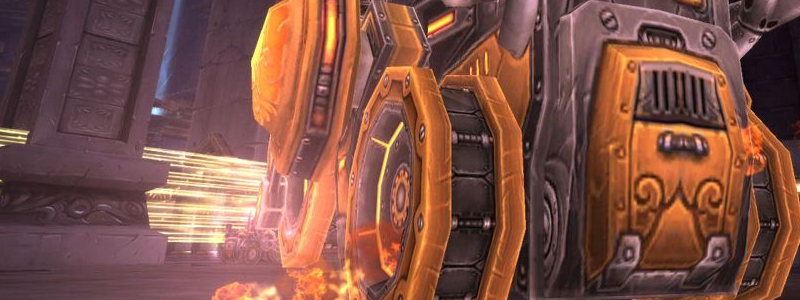

---
tags:
  - "Difficult: Very Hard"
---

# Hard Mode Flame Leviathan

## Overview

> This Hard Mode is significantly more challenging than the extremely simple Normal Mode (which can be cleared with 4-6 Players instead of 25, good for alts).

> The Hard Mode must be toggled on by the Raid Leader before Trash is cleared.  

> It is also known as "4 Towers", as there are 4 Towers found in the large area where Trash is cleared before the Boss. By default, you may choose to deactivate all these Towers. Otherwise, they will be active, empowering the Boss, and may be destroyed (to achieve a combination of Towers of your choice).  

> Thus, for practice, it is possible to kill the Boss with 1, 2, or 3 towers. But this will not yield the "Hard Mode" loot table, and generally our time is better spent in other ways.

## Full Mechanics Rundown

* <ins>All the mechanics from Normal Mode, with no exception, remain</ins>. Each Tower greatly buffs the Boss and any Adds.
    * The amount and stats of the buffs are somewhat irrelevant.
* The Tower of Frost causes __Frost Beams__ (of Light Blue color) to sometimes appear in the arena. They will roam around, looking for Vehicles to lock onto. _They cause no damage by themselves, but once locked on they will stop roaming around and prepare a projectile_. If the Vehicle fails to escape the Beam when it locks onto it, __it will be frozen and take a large amount of damage. All Players must be wary of this, as it may cause a wipe__.
    * <ins>Allies may free Frozen vehicles by shooting cannonballs on them</ins>.
* The Tower of Flame causes a __Flame Beam__ (Orange/Red color) to roam the arena. This one causes __constant, near-lethal damage, also leaving a similarly near-lethal burnt ground where it passed through__. This "fire wall" can easily trap vehicles in corners where they might get killed by the Boss or unable to perform their assignment.
    * <ins>All Players must be wary of it, and preemptively move away from the Flame Beam's path, and away from the Beam in general</ins>.
* The Tower of Storm causes a __Storm Beam__ (Bright/White color) to appear in the arena. It is immobile but will deal massive damage to anyone in it.
    * <ins>All Players must be wary of it</ins>. Must not be mistaken for Frost Beams.
* The Tower of Life causes Adds to appear in _the 4 corners of the arena_. There are both __large, dangerous Adds__ and smaller, less threatening Adds. They appear as if created by the 4 Life Beams (green color) in the corners ; The Beams also do damage but should not be on the Players’ paths anyway.
    * <ins>Adds can be killed by all Players</ins> (though it is preferable to respect assignment) <ins>and may be knocked away</ins> (by ramming them) <ins>or slowed</ins> (by Oil Patches).
* Flame Leviathan actually has 4 NPCs on top of him, which are his Turrets. They cannot be conventionally killed. Once they are all 4 destroyed (simultaneously?), <ins>the Flame Leviathan will Shut Down, disabling it entirely for 20 seconds and taking +50% Damage for the duration</ins>. It also resets the stacks of his ramping-up Movement Speed.

## Essentials

### Siege Engine Driver

* You are the prime candidate to <ins>Ram Adds away</ins> to damage and control them. In fact, <ins>each Engine will be assigned to 1 corner of the arena each, and the 5th one will be assigned to always be on the Boss to Interrupt</ins>.
* Use your Dash to escape the dangerous Beams or the Boss.

!!! note ""
    Estimated Difficulty of the role: 5/10

### Siege Engine Passenger

* <ins>You must use Cannonballs to ignite Oil Patches created by the Choppers</ins>. That way, the Oil will burn Adds, killing them with ease.
* Use the Shield if your Driver drives into certain death and pain.

!!! note ""
    Estimated Difficulty of the role: 4/10

### Chopper Driver

* You actually have a job now! <ins>Drop Oil Patches in the 4 corners</ins>, where Adds spawn. They will be lit up by other Players to handle Adds that stand in the burning Oil. The more well-placed Oil Patches, the better. (One Chopper will be assigned per corner)
* <ins>You __must__ go to the Boss when instructed to, to pick up assigned Players into your Passenger seat and drive them back to the safety of their Demolisher.</ins> There will be marked assignments to make sure each Chopper handles each Player back to its assigned Demolisher.

!!! note ""
    Estimated Difficulty of the role: 7/10

### Demolisher Driver

* Be extremely wary of <ins>your survival</ins>, as the premature death of a Demolisher means a certain wipe.
* (_Only applies to some Demolishers_) <ins>You must catapult your Passenger onto the Boss when instructed to</ins>. Make sure to aim directly on the Boss, preferably slightly towards his upper half. __You cannot shoot Pyrite when your Passenger is loaded__ and awaiting your fire command, so be quick and make sure to <ins>refresh Pyrite one last time when we instruct Passengers to load themselves</ins>.
* The additional hazards of the Beams mean you might require more Pyrite than usual, as your Passenger might use it to give you a sprint. <ins>Make sure you drive close to Pyrite crates</ins>.
* Obviously, __while your Passenger is gone, you will not be refueled Pyrite while in the driver seat!__ You can either <ins>refresh the Pyrite DoT the latest possible</ins> (recommended), or <ins>switch to the passenger seat, pick Pyrite, and switch back to the driver seat before the Pyrite DoT expires</ins>.

!!! warning "Attention"
    _Not all Demolishers might be assigned to catapulting their passengers. (In which case your job will only be slightly harder than Normal Mode)_

!!! note ""
    Estimated Difficulty of the role: 9/10. 

### Demolisher Passenger

* You will have to Sprint more often than in Normal Mode to escape danger, but keep in mind it costs a lot of the precious Pyrite.
* (_Only applies to some Demolishers_) <ins>Fill your vehicle to 100% Pyrite ("mana") before Catapulting yourself, if assigned to</ins>. Preferably wait to see your Driver shooting one last Pyrite projectile before loading up, as he will be unable to refresh Pyrite while you’re loaded.
* If Catapulted successfully, kill Turrets A.S.A.P, using all DPS Cooldowns you can.
Once Turrets are destroyed you will fall to the ground. You should not be in danger for the 20 seconds of the Shutdown, so <ins>make your way back to your assigned Demolisher - Either by walking or jumping into a friendly Chopper</ins>.
* If at any moment you’re on the ground while the Boss isn’t __Shut Down__, use as much survivability (healthstones…) as possible and run to an empty vehicle.

!!! warning "Attention"
    _Not all Demolishers might be assigned to catapulting their passengers. (In which case your job will only be slightly harder than Normal Mode)_

!!! note ""
    Estimated Difficulty of the role: 8.5/10. 

## Special Assignments

* Siege Engines: Assigned to a corner or to stick on the Boss.
* Demolisher: Assigned or not to Catapult their Passengers.
* Choppers: Assigned to bring Passengers back to their Demolisher, and to each corner.
* 1 Shaman: Will be assigned to leave his vehicle and Heroism while close enough to the Boss, to help the Turret killers; then back to his vehicle.

!!! note "Note"
    Due to the high variance of the fight (who gets chased, where do Flame Beams go…) a picture would be mostly pointless.
