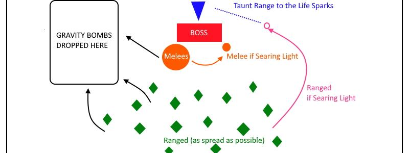

---
tags:
  - "Difficult: Very Hard"
---

# Hard Mode XT-002 Deconstructor

## Overview

> As mentioned above, this Hard Mode is enabled __if the Heart of the Deconstructor reaches 0 HP__. When that happens, XT is __healed to full__ (rather than damaged), increases his total health by 60% and all his Damage by 15%. From that point on, some mechanics of the fight will change.

> <ins>It is ideal to kill the Heart by using as few Cooldowns as possible (both DPS individual CDs and Heroism)</ins> as these will be needed for the rest of the fight.

## Full Mechanics Rundown

* <ins>Both Debuffs will gain an additional new behavior</ins>:
    * __Searing Light__ when it expires, will instantly __spawn an Add called Life Spark__. This add deals high melee damage and thus needs to be picked up near-instantly by the Tank(s), and is likely to kill the Debuffed Player if not topped to full HP (No matter how good the tank is, the add likely will instantly melee the Player it spawns on).
        * It also deals moderate AoE Nature damage around it.
        * __Life Sparks are #1 DPS Focus at any moment they exist.__
        * <ins>The Debuffed Player must thus not only move out of the Raid to not kill allies with Searing Light, but also make his way to be ~20yds away from the tank to allow for a very quick taunt.</ins>
    * __Gravity Bomb__, on explosion, will not only damage and reel nearby Players in, but also __leave a large void zone that will continuously slow and damage any Players that stand in it. This zone never goes away, and thus must be placed with care__, far from the Raid but close enough for Healers to save the debuffed Players.
        * <ins>A preemptive Hand of Freedom will greatly help the debuffed Player by making it immune to the zone’s slow.</ins>
        * One Paladin can provide enough Hands for every Gravity Bomb.
* XT will never enter Heart Phases again from the moment his Heart is broken (he doesn’t have a Heart anymore to show, duh…). As a consequence, no more Adds will spawn and individual DPS cooldowns may be used whenever they pull off the highest DPS. On the other hand, Healers will not be able to freely fix their mana.
* XT will cast Tympanic Tantrum on a fixed timer (1 minute). This is a long, channeled spell that deals insanely high Damage per second to the whole Raid, scaling on their Max HP (200% HP over the duration).
    * This is a very demanding mechanic, <ins>for which I will thoroughly detail individual responsibilities in the Essentials below</ins>.

## Strategy Image Reference

## Essentials

### Tanks

* All Tanks should weave defensive cooldowns during Tantrum. XT is also punishing to Tanks outside of Tantrums, but Healers will have infinitely less pressure in those moments.
* Paladin Tanks can use Hand of Freedom on Gravity Bombs that are about to expire, and Hand of Protection on debuffed Players if a Tantrum is about to happen (the HoP will prevent Tantrum damage, but not the debuff itself. Taking damage from both is often lethal)
* Druid Tanks can use Barkskin + Tranquility during Tantrums (healing cooldowns will be on rotation) if they make sure they shift to Bear before the Tantrum ends.

### Healers

* For Tantrums, <ins>all Healers will be assigned to heal a group(1 to 5) and/or to specific targets</ins>. Is it primordial to respect that assignment as closely as possible, as the whole Raid will take very heavy damage and no Player can be left unhealed.
* <ins>Searing Light debuffed Players should receive a nonstop heal spam and sniped with a Heal that lands as perfectly as possible to the expiration of the debuff.</ins>
* Gravity Bombs must only be topped off + shielded.
* This is a very long fight with extremely high HPS output and mana preservation is paramount. Care should be paid to allow Paladins to Divine Plea and Tide/Hymns of Hope to be efficient.
* Extra-ordinary Healing Cooldowns (DHymn, Tranq) will be assigned.
* __Two HPals will alternate Bubble+RaidSac on each Tantrum.__
* Hpals will probably be assigned to heal melee groups.
* Resto Druids will probably actually be forbidden to use Tranquility at the profit of their better spells, unless we run 6+ Healers.
* Resto Shamans will likely be assigned to heal Ranged groups (they will be spread, but close enough for ChainHeals)
* Discipline will have to preshield as many Players as he can before Tantrum (ideally 25), then weave shield+PoH and PoM off cooldown. He will PoH his assigned group.
* HolyPriest will have to precast PoM and spam PoH+CoH on his assigned group. Might vary with talents.

### DPS

* __All classes/specs DPS priority__: Life Sparks >>>>> Any leftover Pummelers when Hard Mode begins >>> Boss.
* Healthstones should be saved for situations where a Searing Light is about to kill you or for a Tantrum where the Raid is starting to drop. In general, you’re free to healthstone if you reach 20% hp during a Tantrum or from a Searing Light damage.
* <ins>Hitting zero Raid members with your Gravity Bomb is mandatory</ins>. Hitting the least possible Players with your Searing Lights is required, and __you must be in Taunt range of the Tank when your Searing Light debuff expires__.
* __List of DPS classes/specs and your job during Tantrums__:
    * <ins>Arms/Fury</ins>: Enraged Regeneration and Shieldwall, preferably one per Tantrum and not the one Heroism will be used on.
    * <ins>Ret</ins>: Might be assigned to DSac rotation. Freely use FoL heal procs on low hp Players. Sacred Shield yourself before Tantrum. Bubble/Shieldwall whenever lacking Forbearance.
    * <ins>Hunter</ins>: Deterrence shouldn’t help against Tantrum, but check if it does, once. Rather, use Deterrence when Searing Light is about to expire so that the Life Spark ignores you.
    * <ins>Rogue</ins>: Use Feint on every Tantrum. Do not Cloak of Shadows a Gravity Bomb. Can Cloak of Shadows instantly on Searing Light, assuming the Tank can react accordingly.
    * <ins>Shadow Priest</ins>: Will be assigned for a DHymn. For all other tantrums, should use PoM when Tantrum begins, and refresh DoTs just before. Might have to also spam PoH, but the push-back from Tantrum will probably make it inefficient.
    * <ins>Death Knight</ins>: Must Death Strike at least once during the Tantrum and use IBF whenever up during a Tantrum. Save AMS for Searing Lights, as Tantrum is Physical Damage. If Frost, Ghoul+DeathPact whenever you’re not using IBF. If Unholy, be ready to Death Pact if you reach 20% HP.
    * <ins>Balance</ins>: Will be assigned to a Tranquility (with a Barkskin to avoid pushback). Will Barkskin every Tantrum anyway. Cast heals during the Tantrum, whichever is the highest output that doesn’t get you oom (pre-shotting Lifeblooms right before Tantrum is a good idea). Is allowed to have bad DPS as a consequence.
    * <ins>Feral</ins>: Will be assigned to a Tranquility (with a Barkskin to avoid pushback). Will Barkskin every Tantrum anyway. Survival Instincts whenever up. Shifting into Bear Form is not mandatory since Cat takes -30% AoE Damage, but can Bear+Frenzied Regen during his Survival Instincts.
    * <ins>Mage</ins>: Can IceBlock freely on Tantrums, but better saved in case of a bad Searing Light. Obviously never Ice Block a Gravity Bomb and never Ice Block a Searing Light if you’re not in range of the tank and outside the Raid. Always Blink when receiving a Searing Light.
    * <ins>Warlocks</ins>: Affli should Drain Life during Tantrum and Death Coil during Tantrum whenever up. Demono should save Metamorphosis for Tantrum due to increased Armor and how he’ll be free to run into melee range without fear of debuffs.
    * <ins>Elemental</ins>: Must spam Chain Heals during the whole Tantrum. The temporary haste from Elemental Mastery will benefit those casts.
    * <ins>Enhancement</ins>: Must expend Maelstrom procs into Chain Heals (or a nicely sniped Healing Wave) for the whole Tantrum. Can expend incomplete Maelstrom stacks for more heals. Use Shamanistic Rage right before each Tantrum. Use Wolves according to Trinkets/Burst cooldowns rather than just to heal yourself.

## Special Assignments

Not really any, aside all that’s written above
