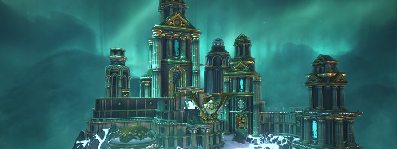

# Introduction

This guide serves as a pre-raid preparation obligatory read.  
Besides watching some videos, information shown here is __very important__ to be known before steping into the raid.  

Ulduar is a very high step from Naxxramas and other Phase 1 content, difficulty wise. Preparing yourself and helping other raid members is a necessary attitude regarding Raid group success.

## The raid

_For millennia, Ulduar has kept itself far from the strife and strife of the mortal races. But since its recent discovery, many have questioned the original purpose of said structure. Some consider it a city built to proclaim the glory of its creators, while others feel it to be a vault containing endless treasures, relics, and even the many powers of the Titans._  
_But they are wrong: behind these doors there is no city or treasure room, not even a definitive answer to the mysteries of the Titans. All that awaits those who venture into Ulduar is a horror that even the Titans would have destroyed, an evil that even they could not contain..._  

<iframe width="800" height="450" src="https://www.youtube.com/embed/xEylX2LJ8c4" title="YouTube video player" frameborder="0" allow="accelerometer; autoplay; clipboard-write; encrypted-media; gyroscope; picture-in-picture" allowfullscreen></iframe>

_...Deep within old Ulduar, an ancient god of death whispers... Tread carefully, or this prison will be your tomb._

## Before heading to encounters

Its very important to read [this](./important.md), since it helps understanding some aspects of the guide.
