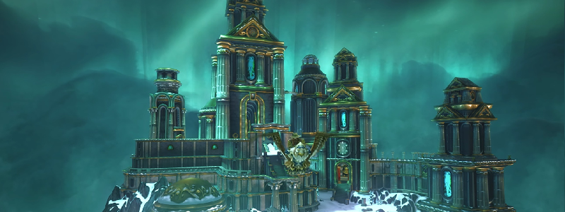

# Introdução

Este guia serve como uma leitura obrigatória de preparação pré-raid.  
Além de assistir a alguns vídeos, as informações mostradas aqui são __muito importantes__ antes de entrar no raid.  
Ulduar é um salto muito alto de Naxxramas e outros conteúdos da Fase 1, em termos de dificuldade. Preparar-se e ajudar outros membros é uma atitude necessária em relação ao sucesso da Guilda.

## A Raid

_Por milênios, Ulduar manteve-se longe das contendas e contendas das raças mortais. Mas desde sua recente descoberta, muitos questionaram o propósito original dessa estrutura. Alguns a consideram uma cidade construída para proclamar a glória de seus criadores, enquanto outros a consideram um cofre contendo tesouros infinitos, relíquias e até mesmo os muitos poderes dos Titãs._  
_Mas eles estão errados: por trás dessas portas não há cidade ou sala do tesouro, nem mesmo uma resposta definitiva para os mistérios dos Titãs. Tudo o que espera aqueles que se aventuram em Ulduar é um horror que nem mesmo os Titãs teriam destruído, um mal que nem eles poderiam conter..._  

<iframe width="800" height="450" src="https://www.youtube.com/embed/xEylX2LJ8c4" title="YouTube video player" frameborder="0" allow="accelerometer; autoplay; clipboard-write; encrypted-media; gyroscope; picture-in-picture" allowfullscreen></iframe>

_...Nas profundezas da velha Ulduar, um antigo deus da morte sussurra... Entre com cuidado, ou esta prisão será sua tumba._

## Antes de ir para os encontros

É muito importante ler [este documento](./important.md), pois ele ajuda a entender alguns aspectos do guia.
