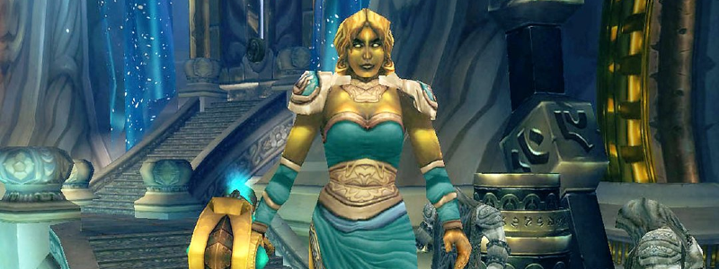

---
tags:
  - "Skippable: True"
  - "Difficult: Medium"
---

# Auriaya

## Overview

> Auriaya (watch the pronunciation) patrols a large room with her 4 cats, as old ladies usually do.  
> The 4 Cats (“Sanctum Sentries'') Adds will always be there on pull and do not respawn. Other Adds will be present in the fight.  
> This fight is mostly a check to survive the Pull and then repeatedly perform the mechanics correctly.

## Full Mechanics Rundown

* __The Sanctum Sentries, on pull, will deal extreme Tank damage__ and have a normal threat table. All cooldowns will be used (Tank, Externals, DPS, Healing) on pull, and likely threat-pullers (Like Boomkins) will be BoPed by Paladins. Auriaya herself will simply swing the Main Tank, for now.
* Guardian Swarm is a fairly unnoticeable ability similar to Maexxna’s spiderlings. The Adds die quickly and merely need attention to threat.
* She will __Fear the whole Raid__ (with Terrifying Screech). _This is a normal Fear_ that can be removed/resisted by Berserker Rage, Lichborne, Berserk, Fear Ward, Trinkets, Dispels…
    * As soon as she Fears the whole Raid, she’ll start casting __Sentinel Blast__. If she completes the cast, she’ll cast it “again” as a Channel. __That Channeled spell causes near-lethal AoE damage__ (it looks and functions like a Mind Sear). <ins>Both the Cast and the Channel can be Interrupted, and obviously should be</ins>.
    * __However, Feared Players are removed from the threat table__. Therefore, any candidate to Interrupt the Boss should ensure the Main Tank (or possibly an Offtank that taunted) isn’t Feared. __As soon as Auriaya is interrupted she’ll simply melee whoever isn’t Feared and is highest on Threat.__
* She will summon a __Feral Defender__ which deals moderate Tank damage and Leaps at Players that aren’t in his close range, which <ins>Interrupts them</ins>. It will be cleaved/multidotted but not specifically focused.
    * __When the Feral Defender dies it leaves a medium-sized puddle that constantly deals damage__ on Players that stand on it. Therefore, it’ll be brought out of the Raid when it’s about to die (but beware of his death to DoTs if it leaps back to the Raid!). <ins>Removing the LoS between the Feral Defender and the Players seems to prevent him from Leaping</ins>.
    * Either way, <ins>the Boss and the Raid will be moved nearly every time a Feral Defender dies</ins>. For there will be multiple deaths: _Auriaya resurrects the Feral Defender a short while after its death._
* She regularly __Sonic Screeches towards her current Tank__, which deals massive damage to anyone in the direction of the Tank - <ins>but that Damage is split among all Players hit. Therefore, the whole Raid should be in front of her when she casts it</ins>, lest the Tank will die. This damage should not cause any deaths.
    * _Melee DPS are free to stay behind the Boss if they move back in front of it to soak the Sonic Screen when she casts it._

## Essentials

### Tanks

* Blow cooldowns on Pull to survive the __Sanctum Sentries__, depending on what you’re assigned to Tank.
* Move the Boss when a Feral Defender dies too close to it, and move Feral Defenders out of the Raid (when they’re about to die) if you’re the Offtank.

### Healers

* Use externals and keep the offtank(s) topped up on pull. That’s where they’ll take the most damage.
* <ins>Dispels Fears if you can and use Fear Ward on the maintank</ins> as assigned.
* Stack with the Raid.

### DPS

* __Focus the Sanctum Sentries on pull and cleave__, don’t bother wasting DPS on the Boss.
* __Interrupt Sentinel Blast only if the current Tank isn’t feared.__
* Stack with the Raid. If melee, stack with the Raid when Sonic Screech is cast, at the very least.
* Cleave/Multidot the Feral Defender but don’t focus it.

## Special Assignments

Priests’ Fear Wards will be rotating on the main Tank. HPals/Prot Pals will Hand of Sac an Offtank on pull and Hand of Protection the Boomkins/Demolocks.

## Hard Mode

There is no hard mode for this boss.
