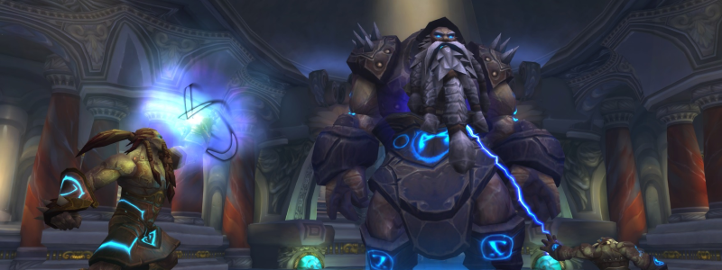

---
tags:
  - "Skippable: True"
  - "Difficult: Easy"
---

# Assembly of Iron

## Overview

> The order in which you kill the Bosses is what causes the fight to either be Normal Mode or Hard Mode (with an in-between “medium mode” that yields no bonus loot but grants you a quest item that otherwise requires Hard Mode)

## Full Mechanics Rundown

* Each Boss is healed to full if another dies. Multidotting and cleaving is thus entirely useless (except maybe the case of Affliction’s Eradication uptime)
* The three Bosses are Steelbreaker (Giant), Runemaster Molgeim (Vrykul), and Stormcaller Brundir (Dwarf). For Normal Mode, <ins>they will die in this order</ins> (“Big to Small”)

### P1

* All Bosses are alive and _this Phase ends when Steelbreaker dies_. The fight may be either 2-tanked or 3-tanked.
* <ins>Steelbreaker</ins> will cast __Fusion Punch__ at his current tank, dealing high Nature damage and applying a lethal Nature DoT. A Paladin Tank may dispel it on himself instantly, other Tanks will rely on a Healer or a Felhunter dispelling it instantly.
* <ins>Runemaster Molgeim</ins> casts Shield of Runes, which should be spell-stolen instantly as much as possible. Not a big deal in Normal Mode.
He also casts <ins>Rune of Power under either of his 2 fellow Bosses</ins>, dropping a large blue AoE. <ins>Any Boss or Player in this AoE deals +50% damage</ins>. It is thus vital to move the Bosses out of it and have as many DPS in it as possible.
* <ins>Stormcaller Brundir</ins> casts interruptible Lightning Bolts and Chain Lightning, of no danger. He can also be stunned in this Phase (and this one only).
He will be tanked far away from the Raid as he also casts __Overload, a long cast that causes lethal AoE damage to anyone nearby__. If his Tank and the rest of the Raid are positioned properly this should be no issue, but it must be paid attention to.

### P2

Steelbreaker dies but the __2 other Bosses retain all their spells, deal increased damage, and gain new abilities__:

* <ins>Runemaster Molgeim</ins> will now be the DPS target. He still casts Shield of Runes, which should be spell-stolen or dispelled instantly when he completes the cast. If not dispelled, Runemaster Molgeim will deal +50% damage for a while. This is manageable in Normal Mode.
    * __He will still cast Rune of Power and DPS must make use of the zone.__
* __Runemaster Molgeim is now able to cast Rune of Death.__ This drops a very large Green AoE at <ins>the current location of a Player</ins>. __The zone inflicts heavy Shadow Damage every second to any Player in it.__
    * DBM will be call to <ins>spread around and stay clear of the Rune of Power</ins>. When the Rune of Death drops, <ins>all Players should move out of it and then move back to the Rune of Power to DPS</ins>.
* <ins>Stormcaller Brundir</ins> is now able to cast __Lightning Whirl__. This is an <ins>Interruptible</ins> channel which, every few seconds, will deal __near-lethal Nature damage to a few random Raid members__. This should be <ins>Interrupted near-instantly</ins>. If Brundir’s Tank is Paladin or Druid, it will be required that a DPS (Shaman/DK/War/Rogue…) will stay on Brundir for <ins>Interrupts</ins>, in spite of his DPS being wasted on him.

_P2 ends when Runemaster Molgeim dies. If possible, DPS will halt until Molgeim drops a fresh Rune of Power_ (they have a limited duration) in order to end the fight faster thanks to the increased DPS.

### P3

Only Stormcaller Brundir remains, dealing further increased damage with all his mechanics.

* He will reflect some damage when hit by Autoattacks, but it is easily healed through. His melee swings are also still close to negligible.
* Now that all DPS are focusing on him, <ins>his Lightning Whirls should be Interrupted instantly by DKs and Enhancement Shamans.</ins>
* His new ability is __Lightning Tendrils__ and will be cast regularly during the fight. When he does, he will fly up in the air (while remaining targetable for Ranged DPS) and deal extremely __heavy damage to anyone close to him__.
    * He is able to move during this ability and __will randomly chase Players at high speed__. It is preferable for the chased Player to <ins>actually stand still and pray for heals rather than risk running away from Healers or running into friends</ins>.
    * Losing Players is acceptable as long as Brundir eventually dies to DPS.
    * He will almost always cast a __Lightning Whirl__ when ending his Lightning Tendrils (usually resetting Threat in the process), thus Ranged DPS should be on the lookout for interrupts as Melees will not be in range yet.
* __He still casts Overload!__ And he often uses __Lightning Whirl__ after one.

## Essentials

### Tanks

* __Move Bosses out of Runes of Power__ (blue) while ensuring Melee DPS can sit in the Rune and still reach your Boss if he’s the kill target.
* You too can be a Rune of Death target. Do not stay near Runes of Power during those timings.
* Make sure you keep facing your tanked Boss(es) while moving in this fight.
* Do not attempt to tank through Stormcaller Brundir’s __Overload__ unless a DK Tank with AMS up.
* <ins>Interrupt</ins> Stormcaller Brundir if your class allows it.
* Self-dispel Fusion Punches (Steelbreaker) if Paladin.

### Healers

* This fight is mostly Tank damage. Make sure they’re all topped off accordingly depending on which Boss(es) they’re tanking.
* Rune of Power doesn’t do much for you but gives you an idea of where the Raid should be.
* Holy Paladins must DSac and/or Shadow AM the Runes of Deaths, and DSac the Lightning Tendrils.
* Be mindful of __Overloads__ from Stormcaller Brundir.

### DPS

* Don’t DPS the wrong target
* __Stay clear from Runes of Power when called to__ (In P2)
* If Stormcaller Brundir casts something then you might as well interrupt it, but __Lightning Whirl__ is the only lethal one. Run away from his Overloads.

## Special Assignments

One DPS might have to sit on Stormcaller Brundir in P2 for the sake of Interrupts.  
A properly managed and macroed Felhunter can handle all Fusion Punch dispels (not-so-relevant for Normal Mode)

## Hard Mode

This boss has a hard mode for the fight. [Click here](../hard/council.md) to check its guide.
