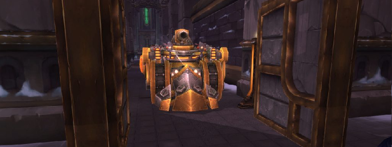

---
tags:
  - "Skippable: False"
  - "Difficult: Very Easy"
---

# Flame Leviathan

## Overview

> This Boss is entirely fought _in vehicles_, in a large arena.  

> There are 3 types of vehicles: Demolisher, Siege Engine, Chopper. All 3 vehicles allow for a driver and a passenger; and the amount of each type of vehicle is limited.

## Full Mechanics Rundown

* _Has no Threat table_. Instead, chases a Demolisher or Siege Engine, __Ramming__ it (_and anyone in Ramming range_) if allowed to close the gap; dealing high physical damage.
* Gains Movement Speed over time.
* Casts _Flame Vents_, a high Raid-Wide damage that can only be <ins>Interrupted</ins> by the Siege Engine drivers.
* Also deals some unavoidable Raid-Wide damage, acting as a Soft-Enrage.

## Essentials

### Siege Engine Driver

* May ram enemies, dealing low damage and knocking them away. Can also do a short dash forward to escape danger. Irrelevant in Normal Mode.
* <ins>Must Interrupt Flame Vents</ins>. Can only be done at short range.

!!! note ""
    Estimated Difficulty of the role: 2/10

### Siege Engine Passenger

* May protect the Siege Engine with a large shield in case of danger. Long cooldown.
* <ins>Must shoot down Flying Adds</ins>, as many as possible, with Anti-Air Rockets (no cooldown)
* Can do pitiful damage with cannonballs. Irrelevant in Normal Mode.

!!! note ""
    Estimated Difficulty of the role: 1/10

### Demolisher Driver

* May shoot cannonballs. Low damage.
* May shoot Liquid Pyrite, _costing 10% of the Vehicle’s "Mana"_. It deals low damage on impact but applies __<ins>a huge DoT, which can be stacked to 10. Almost all of the Damage dealt to the Boss will come from this. It is essential to keep this DoT stacked to 10.</ins>__
* May catapult his Passenger like a projectile. Serves no purpose in Normal Mode.

!!! note ""
    Estimated Difficulty of the role: 6/10

### Demolisher Passenger

* <ins>Must shoot down Flying Adds</ins>, as many as possible, with Anti-Air Rockets (no cooldown)
* May grab Liquid Pyrite to refill 50% of the Vehicle’s "Mana". __<ins>It is essential to supply your Driver with a constant supply of it</ins>__.
* May spend _50% of the Vehicle’s "Mana"_ to double the Vehicle’s Movement Speed for 20 seconds. Should only be used for dire emergencies (e.g getting Chased by the Boss)
* May load himself into the vehicle’s catapult. _Serves no purpose in Normal Mode._

!!! note ""
    Estimated Difficulty of the role: 5/10

### Chopper

* Is much faster than other Vehicles and cannot be Chased by the Boss.
* Can drop Oil Patches, do pitiful AoE Damage, and heal any passenger. Irrelevant in Normal Mode.

!!! error ""
    _Serves no purpose in Normal Mode._

## Special assignments

None.

## Hard mode

This boss has a optional hard mode. [Click here](../hard/flame_leviathan.md) to go to its guide.
