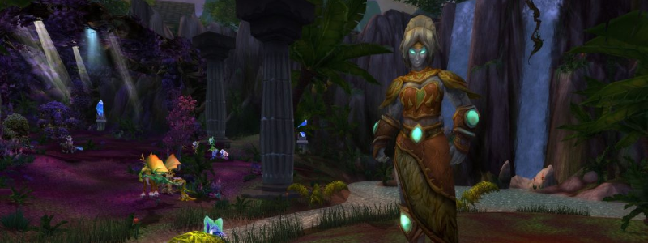

---
tags:
  - "Skippable: False"
  - "Difficult: Easy"
---

# Freya

## Overview

> The large room where Freya roams (she doesn’t bodypull) has a lot of trash, of which 3 Mini Bosses that will be quickly detailed.  
> Normal Mode Freya will usually involve killing these 3 Mini Bosses before engaging her.
> Freya heals herself for massive amounts, decaying over the course of the fight. <ins>DPSing her on pull is utterly useless</ins> and a waste of trinket procs. A fairly unremarkable Phase2 will happen once that healing is removed by dealing with 6 waves of Adds.

## Mini-bosses Rundown

1. Elder Stonebark, first to be pulled, uses Ground Tremors, dealing __Raidwide damage and interrupting.__
    * He buffs himself with Stone Bark, causing __massive reflect damage on melee hits__. Dual Wielders should stop DPSing entirely.
    * He buffs himself with Fists of Stone, massively increasing his melee damage but slowing him. __The Tank must run out.__
2. Elder Ironbranch, second one in the back right, casts Iron Roots on a single random Player. This places a “Iron Roots” NPC on top of the Player, which keeps the Player debuffed with a snare and large damage over time. Killing the NPC removes the debuff, as does Hand of Freedom (shouldn’t happen pre-nerfs)
    * He’ll also Impale the Tank, dealing massive damage. Should be a Tank swap but can be survived through.
3. Elder Brightleaf, the last one, regularly shoots high-damage bolts at random Players that can’t be avoided and might cause butthurt due to one-shots.
    * He also places Sunbeams that continuously damage Players under it, and continuously empower him if he stays under it. __Tank should simply keep moving him nonstop.__

## Full Mechanics Rundown

_Note that Freya will be engaging the Tank in melee during the whole fight, but the damage is easily fixed._

* Sunbeam: One of the few spells Freya herself will use. Simply deals AoE damage on a random Player after a short cast. Can’t really be avoided, but rewards spreading.
* __Eonar’s Gift/Lifebinder’s Gift__: Spawns a small targetable tree NPC. If the tree remains alive for long enough (~15s?), it will massively heal Freya and any Adds present. This is not a hard mechanic, even in Hard Mode: The tree dies easily even to a single Player collapsing on it.
* Attuned to Nature: As mentioned before, Freya will heal herself constantly. Every wave of Adds that she summons will reduce the healing by 1/6th. She won’t summon Adds after the 6th wave, which is when her healing will be near-nullified. When that happens, a short Phase2 begins.
    * These 6 waves of Adds are on a timer, so it is possible to have several waves if the DPS is low, or a large dull empty time if DPS is high. They spawn in a random order, but will always involve three types of waves, happening twice each.

Now, onto the Adds:

### Ancient Conservator

* The Ancient Conservator is a single, large treant. Upon spawning he will cast Conservator’s Grip. 
* __The Conservator’s Grip continuously Silences and Pacifies__ anyone who’s not standing under Mushrooms that continuously sprout around the room, grow in size and then eventually shrink. Standing under a Mushroom grants a +50% Damage increase to reward you while we’re at it. The Mushrooms still spawn even when Conservator’s Grip is cancelled.
* As long as the Conservator is alive, __Nature’s Fury__ will be regularly cast on one random Player. Nature’s Fury (A.K.A Lightning Rod) __deals large Nature Damage every second to any other Players near the debuffed Player__. Move out of the Raid!

### Exploding Lashers

* A swarm of ~12 smaller Adds. They deal noticeable damage to their threat target in spite of how many there are, caution is therefore advised with threat.
* They __explode__ on death (It’s in the name, hey) dealing Fire damage, sizable enough to kill Players if mismanaged. <ins>They must be crowd controlled (as much as possible) before they die, stepped clear from, and finished off.</ins>
* The Raid will usually <ins>stack</ins> when they appear (so that they’re easily blown apart by AoE, including Tank Threat AoEs) and <ins>then spread</ins> after some AoE crowd control has been dropped (Frost Trap/Earthbind/Shadowfury…)

### Guardians of Nature

That’s their official name. They’re actually three Adds with roughly the same HP pool. __They must die within a 12 seconds interval__, lest they revive each other (DPS switch will be called):

* The Storm Lasher regularly zaps nearby enemies with Nature damage which can be shrugged off. He also casts a fairly underwhelming lightning bolt at his current target, which should be interrupted even though it’s not a death sentence. He’s the easiest to deal with.
* The Ancient Water Spirit has only one mechanic: a 2-second cast that will, if completed, __charge at a faraway Player, dealing massive damage in its path__ (but not one-shotting in Normal Mode). <ins>This cannot be interrupted but other crowd control will work (Stuns mostly)</ins>
* __The Snaplasher__ is a most peculiar mob that deals reasonable damage to his threat target, but greatly increases his melee damage as he receives damage - up to “One-Shot the Tank” territory. He’s easily crowd controlled by slows however. Everyone dishing threat on the Snaplasher should be wary of not pulling aggro. It’ll usually be handled by a Hunter or an Offtank (taunting but not meleeing) with assistance from a DK’s Chains of Ice.

### P2

Once 6 waves of Adds have been dealt with, Freya will enter Phase2. She will still cast Sunbeams and Lifebinder’s Gifts, but has mostly one last mechanic:
* Nature Bombs will be dropped <ins>on the Players’ positions</ins>. __After a short delay, they will explode.__ This is easily handled by having the Raid grouped loosely around the same spot; moving a safe distance away whenever bombs are dropped. A good landmark that we’ll use is crossing a river back and forth whenever bombs are dropped.
When Freya reaches 0 HP, the fight ends.

## Essentials

### Tanks

* Freya’s Tank doesn’t have much to do, and will likely pick up the Storm Lasher or the Water Spirit.
* __Do not attempt facetanking the Snaplasher.__

### Healers

* __Move out of Exploding Lashers when they’re about to die, and run away from teammates when debuffed by Nature’s Fury.__

### DPS

* Pay attention to the DPS focus on Allies of Nature and do not facetank the Snaplasher.
* __Move out of Exploding Lashers when they’re about to die, and run away from teammates when debuffed by Nature’s Fury.__
* Stay under Mushrooms when the Ancient Conservator is active.

## Special Assignments

Snaplasher crowd controller(s).

## Hard Mode

This boss has a hard mode for the fight. [Click here](../hard/freya.md) to check its guide.
