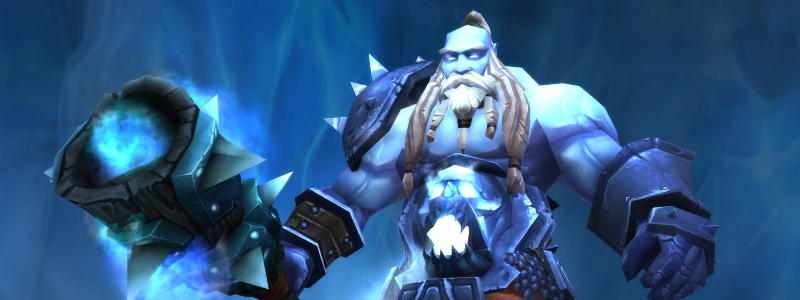

---
tags:
  - "Skippable: False"
  - "Difficult: Easy"
---

# Hodir

## Overview

> Hodir has a lengthy list of mechanics, but for the purpose of Normal Mode, only survival is needed.  
> Hodir himself is fairly straightforward. The fight ends when he reaches 0 HP (though he technically doesn’t die).

## Full Mechanics Rundown

* __Biting Cold__: Similarly to the last Nexus Boss, Players stack up Biting Cold __whenever they are not moving__. Each stack deals Frost Damage, stacking infinitely. Moving only removes one stack per check - _so the longer you stand still, the more you’ll have to move to remove stacks._
    * It is assumed this damage will not be a problem if Players are moving correctly - that is, often.
* __Icicles__: Constantly through the fight, __Icicles will land on spots marked with a reticle a few seconds before landing.__ These spots _will appear directly on top of random Players._ Dodging those icicles encourages you to remove your Intense Cold stacks. Icicles deal roughly 45% of a Player’s HP and knock them aside. Taking two Icicles in a short row is usually a death sentence, and you should be able to never get hit by these.
* __Flash Freeze__: _Both the name of enemy Adds in this fight and one of Hodir’s spells._ The fight begins with 5 Flash Freezes in the arena. <ins>These are actually icy tombs that imprison 5 unique friendly NPCs that will be freed on pull by breaking the Flash Freezes. These NPCs provide great boons when freed.</ins>
    * When Hodir casts __Flash Freeze__ (exactly every minute), those NPCs will be entombed again. This is a long cast that also causes __two very large snow piles to drop from the ceiling.__ Similarly to Icicles, these will be marked by a large reticle on the ground. __Players must move away from the landing spot of these snow piles, then must run and climb on top of them.__ Failing to be on the snow pile when Hodir completes his cast will __cause the Player to also be entombed in a Flash Freeze that will need to be broken__ to allow the Player to jump back into the game.
    * You should strive to never fail that mechanic, ever.
* __Frozen Blows__: Right after completing his Flash Freeze cast, Hodir will gain Frozen Blow for a while. While it’s active, the whole Raid will take massive Frost damage every few seconds, and Hodir will convert a portion of his damage dealt to the Tank from Physical damage to Frost Damage.
* __Freeze__: Regularly cast throughout the fight on random Players. <ins>Prevents movement and must be dispelled</ins> before it causes the Player to be unable to dodge the other mechanics by movement.

## Essentials

### Tanks

* Solo-Tank fight. To beat Normal Mode Hodir, no movement will truly be required of you.
* Save your cooldowns for __Frozen Blows.__
* Do not fail the movement mechanics.

### Healers

* Use externals and Raid mitigation cooldowns during Frozen Blows.
* Dispel the Freeze (mostly up to the Disc Priest)
* Do not fail the movement mechanics.

### DPS

* On pull, __specific Flash Freezes will be focused to be #1 DPS priority.__ The other Flash Freezes are still higher priority than Hodir.
    * Return to these Flash Freezes and destroy them every time new ones appear right after a Flash Freeze.
Use self-defensive CDs during Frozen blows.
* Do not fail the movement mechanics.

## Special Assignments

None of great importance. An extra Priest might be tasked to dispel.

## Hard Mode

This boss has a hard mode for the fight. [Click here](../hard/hodir.md) to check its guide.
