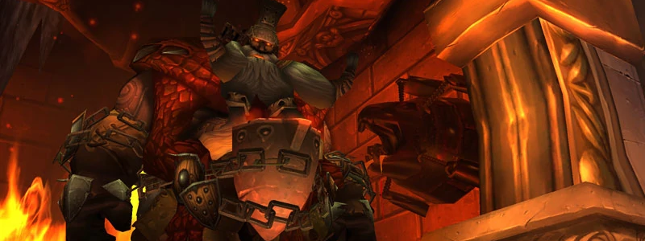

---
tags:
  - "Skippable: True"
  - "Difficult: Medium"
---

# Ignis the Furnace Master

## Overview

> Ignis is a single-Phase Boss with a heavy focus on the offtank and the Healers. It’s the closest you’ll get to a Patchwerk DPS meter bragging rights.

## Full Mechanics Rundown

* Scorch: Breathes fire, so no standing in front of the tank. Every time he Scorches, he’ll leave <ins>burnt ground</ins> on the Tank’s location. It isn’t lethal but shouldn’t be stood on for more than a second.
* __Slag Pot: Grabs a random Player__. That Player cannot move but can still do most actions (_like casting heals on himself_) and will take massive Fire damage over the duration. When it expires, the Player gains 100% Haste for a few seconds to make up for the DPS loss.
* __Flame Jets: High Raid-wide damage that also interrupts spells being cast__.
    * <ins>Concentration Aura+Aura Mastery will prevent the interrupt</ins>.
* Iron Construct: Tank and Spank Adds. _Each one alive greatly increases Ignis’ damage_. They have a lot of health and shouldn’t be DPS’d, and instead must be kept in <ins>burnt ground</ins>(See 1.) by the Offtank _until they have gained 10 stacks of Heat, turning them Molten. Molten Adds deal increased damage, and will turn Brittle if brought into the water zones_.
    * Brittle Adds _die instantly_ if they are dealt a <ins>high enough amount of damage in a single blow (e.g a crit Arcane Blast)</ins>, __dealing high AOE Damage around them by shattering__.

## Essentials

### Tanks

* The main Tank has an easier job but must still ensure the Boss is tanked in the proper spots, <ins>near the water</ins>, to ease the offtank’s job. Cooldowns can be used freely when he Flame Jets, especially if he has 1+ stacks of his Adds-related buff.
* The Offtank has a harder task. He must pick Adds (and constantly hold threat to the end), <ins>bring them to fire patches</ins> (preferably without taking damage from the patch itself), <ins>raise their stacks to 10, then lead them to the water and clear off</ins> while someone shatters the Add.

### Healers

* Spam heals on the __Slag Pot__ target. Your UI must be able to reflect who that is.
* Stop casting when Flame Jets are about to happen, unless specified otherwise that a Paladin Conc Aura Mastery is being used.
* Keep both Tanks healthy and be wary of pulling Threat on the Adds when they become Molten.
* If Slag Potted, heal yourself.

### DPS

* Do not waste damage on the Adds and do not take unnecessary damage from burnt ground.
* Stop casting when Flame Jets are about to happen, unless specified otherwise that a Paladin Conc Aura Mastery is being used.
* If Slag Potted, <ins>use all the survivability you can</ins>.

## Special Assignments

One DPS will be tasked to deal a large amount of Damage in a single blow on Brittle Adds when they enter the water. Mages or Hunters are good candidates for it, though other classes can apply.

## Hard Mode

There is no hard mode for this boss.
