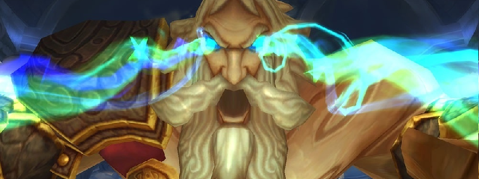

---
tags:
  - "Skippable: False"
  - "Difficult: Medium"
---

# Kologarn

## Overview

> Kologarn has a chest and two arms. Each of them has a separate HP bar, and his Arms can regrow.  
> This fight is simply a coordination check of DPSing the right target among these three options and ensuring Tanks communicate properly.  
> The fight ends when Kologarn’s Chest (Will be referred from this point on as “Kologarn”) reaches 0 HP. If an Arm dies, the chest instantly takes half the damage the Arm has suffered before dying (so, 50% of the Arm’s max HP)

## Full Mechanics Rundown

* The fight ends when Kologarn’s Chest (Will be referred from this point on as “Kologarn”) reaches 0 HP. _If an Arm dies, the chest instantly takes half the damage the arm has suffered before dying_ (so, 50% of the Arm’s max HP) __but Adds will be spawned on the position of the Arm.__ Kologarn will also _lose an ability_ until his Arm has regrown (with full HP):
* His Right Arm’s ability (Note: Since he’s facing you, that’s your left) is __Stone Grip__. The Right Arm grabs 3 random Players, entirely incapacitating them and dealing heavy damage over time. <ins>Dealing enough damage to the Right Arm will free the Players</ins>, and failing to free them will __instantly kill them instead__ after a short duration.
    * __Right Arm will always be #1 DPS target when it grips someone.__
* His Left Arm’s ability (Note: Since he’s facing you, that’s your right!) is __Shockwave__. This is simply a heavy, instant Raid-Wide burst of damage (40-70% HP) which causes no problem if Players aren’t taking damage from other mechanics.
* Removing both Arms will disable both these abilities indeed, but will cause Kologarn to shout on the Raid (after all, he can’t attack with his Arms anymore) for heavy Raid-wide damage. __This is generally something we’ll avoid__, even though it’s certainly not an instant wipe.
    * __Removing any Arm will cause Rubble (Adds)__ to spawn. These are not to be taken lightly: They deal reasonable damage to their target and __heavy AoE damage__ around themselves. They should be killed A.S.A.P, <ins>preferably by Ranged DPS</ins>, as Melee DPS might get killed by their AoE.
* Kologarn himself has a few abilities that he’ll use independently of his Arms:
    * He’ll __Sunder Armor__ his current Tank every now and then, easily solved by a Tank swap. <ins>Tanks should preferably have no stacks when it is decided to kill an Arm</ins>, so that they can safely handle the Rubble Adds.
    * He’ll Smash in front of him, dealing low damage to anyone in melee range of him and <ins>Interrupting</ins> them. <ins>All Casters and Healers therefore have to stay out.</ins> (This is apparently the same ability as his Sunder Armor? Must check.)
    * He’ll use __Focused Eyebeam__ a random Player that is not in his melee range (if everyone is in melee, he’ll do it on a melee instead, and we don’t want that). The Beam deals __heavy damage__ (enough to kill when added to other sources of damage) but <ins>can be out-ran if the Player keeps moving</ins>. If the Raid isn’t under pressure, it can be healed through, and defensives (like Iceblock) will work. __The chased Player should be cautious to not bring the Beam into any allies, and to not run into Rubble Adds while running from the Beam.__

## Essentials

### Tanks

* Communicate to ensure Kologarn’s Tank doesn’t have 3+ stacks of Sunder Armor (preferably swapping at 2 or even less) and the Rubble Adds Tank doesn’t have too many stacks and doesn’t bring Adds into melee range. They should be tanked where they spawn.
* Cooldowns can be used depending on the situation: Sunder Armor stacks, presence of Adds or not, Healers being Stone Gripped...

### Healers

* Heal <ins>Gripped</ins> Players if you aren’t missing Line of Sight, Focused Beamed Players, Tanks and Melees accordingly to ensure they don’t die to Shockwave damage.
* Rumble Adds deal heavy damage to the Tank, so keep him topped. If Melees are near the Adds, though they shouldn't, be ready to AoE Heal.
* You can self-heal if chased by a Beam, mostly if a HPal since moving is bad for you.

### DPS

* Listen to the calls for which target to focus DPS on. __Right Arm will always be focused when Players are Stone Gripped, Adds will always be focused whenever they exist.__
* Don’t go near Adds unless you’re a Plate and know what you’re doing (def CDs, healthstone…).
* Run away from Focused Beams without crossing other Players or Adds.

## Special Assignments

Hunters should have Misdirect+Volley ready when Adds are about to spawn (when an Arm dies).

## Hard Mode

There is no hard mode for this boss.
