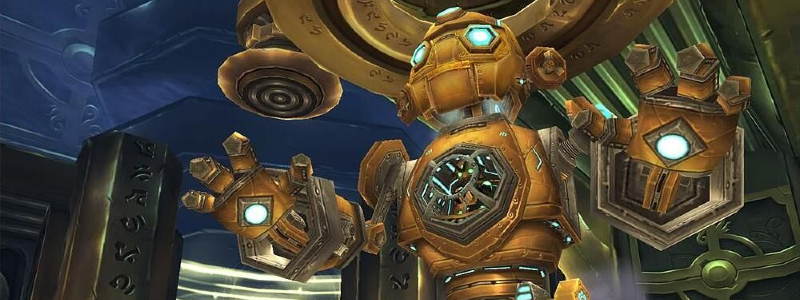

---
tags:
  - "Skippable: False"
  - "Difficult: Medium"
---

# Mimiron

## Overview

> Mimiron is fought in a total of 4 different Phases, with the fourth one merging parts (literally) of the previous Phases. It features simple, yet extremely punishing mechanics that usually result in oneshots.

## Full Mechanics Rundown

### P1

Mimiron engages the Raid in a Tank.

* He will regularly cast Napalm Shell at a random Raid member, preferring Ranged. The shell affects the Player _and any nearby allies_ (DBM will show a range radar) with a heavy DoT debuff (Fire Damage). There is enough room so that Napalm Shells should never hit more than the Player it targets. Healing two Players hit is manageable, though. The loose spread might mean some Players are out of range of most Healers.
    * _Napalm Shells looks like it’s a fire AoE on the ground but actually isn’t - it just chooses a Player and hits them when it lands. There is no point trying to “move out of it”, the only movement needed is to fix a poor spreading._
* He will cast a few __Plasma Blasts__ (2-3) on his current Tank, channeling to deal massive Fire damage over the duration of the channel. Tank cooldowns and Externals will be used here.
* He will cast a few __Shock  Blasts__ (2-3), a long cast that deals lethal Nature Damage once complete. Everyone should __run out of it__.
* He will drop __Land Mines__ around himself, _slightly outside of his melee range_, frequently. These will only explode if stepped on. <ins>Melees should be cautious when running out of Shock Blasts, as there will surely be Mines on their way</ins>. They are dropped in a semi-random pattern, usually leaving a few gaps to escape through. Two mines worth of damage is lethal.

### P2

Mimiron engages the Raid in a robotic chest.

* No melee swings from the Boss. Instead, he constantly casts Hand Pulse, dealing Spellfire damage in a direction (_targeting a random Player and hitting everything in its direction_). 
* Regularly Fire Novas (direct damage+DoT). Not an issue even with many Players close to him.
* Casts __Rockets__ on random Players, preferring Ranged. The landing spot is marked in a bright red, and should be moved out of A.S.A.P. __Lethal damage.__
* Casts __Laser Barrage__: first he’ll wind up in a direction, leaving time for the Players to run to the sides. Once done winding up, __he’ll constantly deal lethal damage in the direction he’s firing, slowly rotating__ in the process. Hand Pulse is disabled during the barrage but will resume instantly once the Barrage is complete.

### P3

Mimiron will be flying in a robotic head (“_Aerial Command Unit__”). He’s targetable but cannot be reached by melee sources. Melees will instead be dealing with Adds on the ground, not only to relieve the Raid but also to bring down the flying head.

* __Plasma Ball__: The Head doesn’t melee but instead constantly fires every 2 seconds for 8k-10k worth of magic damage on its current threat target. Can be healed through as long as threat doesn’t constantly bounces between Warlocks - better handled by having one Demolock (because of Soul Link) weaving a few Searing Pains to out-threat everyone. Can also be repeatedly taunted by a Tank.
    * If the threat target moves out of range the head will follow along. It is otherwise immobile.
* __Bomb Bot__: the Head drops a Bomb Bot NPC right below its current position. It has low health and should be killed from range as it will detonate if it reaches its threat target. <ins>Chains of Ice and other CC work here.</ins>
* __Assault Bot__: Tanky Adds that will spawn on locations marked by a red beam (the beam itself does nothing). Deal high melee damage (enough to clap clothes) and can root the Tank (which can be dispelled). <ins>When Assault Bots die they drop an item that can be picked up</ins> (depending on loot rules, but usually anyone). <ins>Whoever picks the item must move below the Head and use the item, which will cause the Head to fly down to melee range, be incapacitated and take +50% bonus damage.</ins>

Additionally some Junk Bots will spawn from green beams but they’re nearly harmless and simply need to be picked up and cleaved.

### P4

Mimiron combines the three parts fought previously. This results in a selection of mechanics encountered previously:

* The Bottom (“Tank”) melees his current Tank, can move after his current Tank (moving the bottom causing the whole robot to move), casts __Shock Blasts__ (lethal) and lays __Landmines__ (near-lethal).
* The Middle (“Chest”) fires Hand Pulses, launches __Rockets__ (lethal) and will cast 1-2 __Laser Barrages__ that will need to be moved out of.
* The Top (“Head”) casts __Plasma Balls__ at his current threat target.
No Adds will be involved in this Phase.
* Mechanics from previous phases that aren’t mentioned right above will not be present

Additionally, these three parts must be destroyed within 15 seconds of each other. If not, they will all be healed for 50% max HP.

## Essentials

### Tanks

* P1: Use cooldowns on Plasma Blast and do not facetank __Shock Blast__. Do not trigger __Landmines__ when running from Shock Blast.
* P2: __Avoid Barrages.__
* P3: Pick up all the Adds you can, but <ins>do not cause Bomb Bots to blow people up</ins> if they reach you.
    * Use the item dropped by the Assault Bots below the Head if you loot it.
* P4: Do not facetank __Shock Blast__. Do not trigger __Landmines__ when running from Shock Blast. __Avoid Barrages.__

### Healers

* P1: Stay spread and <ins>prioritize heals on Napalm Shells and Plasma Blasts.</ins>
* P2: __Avoid Barrages__ and pump AoE Heals. Run out of the Rocket landing zones.
* P3: Heal the target of the Head (<ins>your UI should reflect who has threat from something</ins>) and the Tank. Stay out of Bomb Bots and Assault Bots.
* P4: __Avoid Rockets, Barrages__ and heal both the Tank and the Head’s target.

### DPS

* P1: Do not facetank __Shock Blast__. Do not trigger __Landmines__ when running from Shock Blast. Ranged must stay spread.
* P2: Avoid __Barrage and Rockets.__
* P3: Mind your threat on Bomb Bots and Assault Bots. Ranged can stay on the Head for the whole Phase, (might be up to change for Hard Mode) but multidotting the Assault Bot is welcome.
    * Use the item dropped by the Assault Bots below the Head if you loot it.
    * <ins>Burst the Head when it’s down on the ground.</ins>

## Special Assignments

A Ranged DPS (or other) to maintain threat on the Head (P3&4), a specific Player to handle the item dropped by Assault Bots (P3).

## Hard Mode

This boss has a hard mode for the fight. [Click here](../hard/mimiron.md) to check its guide.
