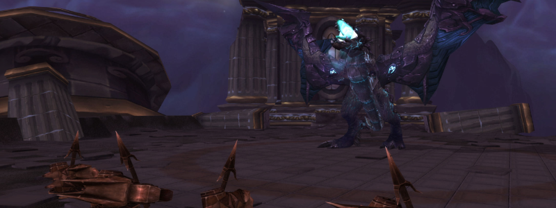

---
tags:
  - "Skippable: True"
  - "Difficult: Easy"
---

# Razorscale

## Overview

> There are ideally only three Phases in this fight, but P1 and 2 might repeat if DPS is low.  

> In P1 Adds will be fought until the Boss can be grounded.  

> In P2 the Boss is harmless and nothing can damage the Raid except leftover Adds.  

> In P3 no Adds will spawn but the Boss will fight the Raid.

## Full Mechanics Rundown

### P1

* Fireballs will hit a few random Players every now and then. Easily healed but can add up with other mechanics.
* Patches of blue Fire will spawn on a Player. Fire burns.
* <ins>Dark Iron Sentinels</ins> (tall Vrykuls) will OS non-Plates (and might OS Plate DPS) with __Whirlwind__. All non-Tanks must make sure they don’t stay nearby, and the main Tank should pick these (and only these) and keep them out.
* <ins>Dark Rune Guardians</ins> and <ins>Dark Rune Watchers</ins> (both are iron Dwarves) are tanked by the Offtank and have no noteworthy mechanic aside from doing damage to their main target. Neither should be a problem if tanked and killed in due time.
    * The Watchers are interruptible.
* Friendly NPCs build turrets over time. These will be clicked by a single assigned Player to bring down the Boss. Rest of the Raid should pay no care to this.

### P2

* There are literally no mechanics in this Phase. Adds and Fire patches that might be left over from P1 will remain, Adds should be cleaved with the Boss except Sentinels which must still be kept out and prioritized by Ranged.
* All DPS cooldowns (including Heroism) must be used here and Healers can freely fix their mana while DPSing as much as they can.
* If Razorscale has more than 50% HP at the end of P2 she’ll (slightly) damage the Raid and fly back up, restarting P1 all over again with the exact same mechanics.

### P3

* While you’re actually fighting the dragon in this Phase, there isn’t much to be said about it.
* Fire Patches will continue to be dropped but other mechanics are gone. Razorscale breathes fire, and thus no one but the current Tank should face her.
* Tanks might receive stacks of a Debuff that will greatly increase the damage they take, and may swap if the current tank receives 2+ stacks of the debuff.

## Essentials

### Tanks

* Pick your assigned mobs, deal as much Threat as possible and stay out of the Fire.
* Sentinel Tank should ensure no one is close to him.

### Healers

* Pad your meters and don’t stay in Fire or close to Sentinels.

### DPS

* Melees should never be near a Sentinel. Ranged DPS must kill them first.
* Watch your threat on all Adds and interrupt Watchers if you can.

## Special Assignments

1 Hunter (or anyone, really) will click the Harpoon Turrets. There is no bad moment to click them, if they’re clickable then they can be clicked with no downside. The only thing that matters is that the last one should be clicked instantly when ready.

## Hard Mode

There is no hard mode for this boss.
