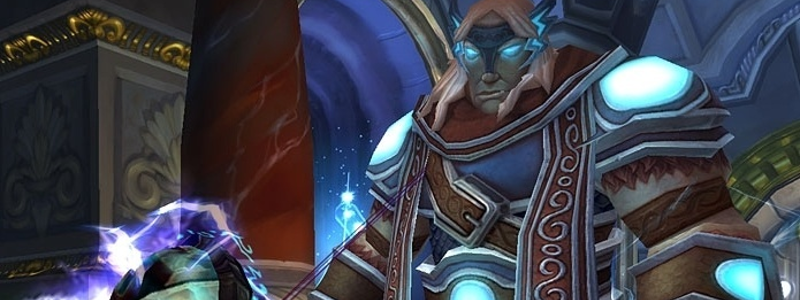

---
tags:
  - "Skippable: False"
  - "Difficult: Medium"
---

# Thorim

## Overview

> Thorim is a two-Phase fight, in which Thorim himself will only be fought in the second Phase.  
> The first Phase also splits the Raid in <ins>two groups</ins> that will have two very different battles to deal with: They will be referred to as the “Arena” group/room and the “Gauntlet/Tunnel” group/room.  
> Once the Gauntlet group finishes fighting through a passage that allows them to reach Thorim, dealing any threat to him will cause him to jump down into the Arena, and P2 will begin. Gauntlet Players are then also free to jump down to return to the Arena, which is where the pull happens.  
> Players should mostly be concerned about their survivability.

## Full Mechanics Rundown

### P1: Arena

* Quite a few Adds will be present before the pull happens. They must be killed to proceed, and the timer for the fight actually only starts once they’re dead and Thorim gets pissed. These Adds aren’t very threatening or special, aside from __a giant worm that needs to be faced away from the Raid.__
* Players that are assigned to remain in the Arena should do a loose spread whenever possible, as Thorim will regularly stun a Player (unavoidable), and cause that Player plus anyone nearby to take Nature damage and increasing their spell casting time by 75% (for that reason, Arena will mostly be Melee DPS and Hunters).
* Spreading against this mechanic isn’t easy, as the pillars around the arena will sometimes activate and spout lightning at Players that have moved towards them. Moving away from the source of the lightning will simply fix the problem, and the damage shouldn’t cause a death if reacted to.
* Adds will regularly spawn and enter the Arena. There are four types of them:
    * Commoners, a swarm of fairly weak Adds. They interrupt their target, so the Tank should ensure Healers do not pull threat off them.
    * __Champions__, dangerous Adds that are similar to Razorscale’s Sentinels as they are defined by their deadly __Whirlwind__. They can also Charge targets outside their melee range, making them extremely dangerous and __the #1 DPS Priority__. 
    * __Warbringers__, melee Adds that deal high tank damage and buff their allies with a passive Aura. Be wary of pulling Threat on them. <ins>May be Mind Controlled to provide that Buff to the Raid Group instead</ins> (and to deal acceptable damage). They do not need to be focused as long as they’re in low numbers and the Tank isn’t overwhelmed.
    * Evokers, who commonly spawn with Warbringers (but combinations with Champions also happen) are _Casters who do not engage in melee_ (and deal low melee damage if silenced). They can disrupt the Arena group greatly by _shielding, damaging, and buffing themselves to be immune to interrupts._ <ins>Offensive dispels and interrupts</ins> are ideal against them, making Enhancement Shaman the perfect pick. They are second in Priority behind Champions.
    * <ins>Adds will spawn until P2 begins</ins>. Therefore, Arena group must survive the war of attrition until Gauntlet group completes their task.

### P1: Gauntlet

* Once the starting Adds are dead, a <ins>Lever will become clickable</ins> to the left of the Arena. Maintaining the “cast” to open it will open the door to the Gauntlet.
* The first part of the Gauntlet will contain Adds and a Mini-Boss at the back of the room. This mini-Boss will blast the room with a __forward-moving fire AoE. He may blast either half of the room (left or right), and chooses between the two halves randomly.__ The Gauntlet group should be wary of that and constantly move to whichever half of the room is safe.
    * Getting hit by the AoE should not be a one-shot but is still heavy damage that can get out of control. It seems getting hit by the AoE while edging in the center of the room also causes double damage (likely killing the Player). Fire Aura Mastery and DSacs are useful here.
    * Those AOEs cease when the Mini-Boss is engaged in combat (__though he will complete his last AoE before starting to fight__).
    * __The Iron Ring Guards__ (Adds) on the path to the Mini-Boss deal __heavy damage to the Tank__ and can stun him (causing even further damage by preventing him to dodge/parry), and apply a heavy __Bleed effect that must be healed to 100% HP to be removed.__ Hand of Sacrifice is very much worth it, as are other externals and tank cooldowns. The Guards also __Cleave__ for heavy damage and should be <ins>faced away from the Raid even when moving away from AoEs.</ins>
    * An __Acolyte__ will also assist the Guards with heals and Smites, and <ins>should be killed first</ins>. He may cast a powerful Renew on himself or the Guards which must be <ins>Dispelled</ins>.
    * Mini-Boss(Runic Colossus), once engaged, has a few rules which the Gauntlet group must follow:
        * All Players <ins>must be in melee range</ins>, lest the Mini-Boss will Charge them repeatedly;
        * All Players <ins>should be behind him</ins>;
        * At 50% HP, he’ll shield himself, taking reduced damage and reflecting (some) of the incoming Physical damage. Attention is required for any dual-wielders in here.
        * Once the Mini-Boss dies, the path behind him will open.  
* The second section involves moving upstairs. There will be more Acolytes (<ins>to kick, dispel, and focus</ins>) and __Iron Honor Guards__ who deal less Tank damage but still Cleave hard, and Hamstring the Tank to slow the progression (easily fixed by two rotating Hands of Freedom, usually ProtPal + HPal).
    * As soon as the group sets foot on the first stair, __Iron Honor Guards will regularly spawn from upstairs__, right below the second Mini-Boss. These respawns aren’t overwhelming but might be a problem if the Mini-Boss is engaged right after a respawn.
    * On pull, the __Mini-Boss(Ancient Rune Giant)__ will greatly buff any remaining Adds (Acolytes and Honor Guards). This isn’t a death sentence if 1-2 Adds remain but will roughen up the fight. <ins>Buffed Adds should definitely be disposed of before moving onto the Mini-Boss himself.</ins>
    * The Mini-Boss will regularly shove around himself for moderate damage+knockback, and will regularly __mark a Player with a rune__ (DBM will mark it as Skull) __that will cause high fire damage around the Player after a delay__ and prevent that Player from moving. As long as Players move out of marked Players, this damage shouldn’t be a problem, but slacking on that movement can overwhelm Healers.
    * Once the Mini-Boss dies, the path further opens to Thorim.
* The last section has no enemies to kill but instead __will trap Players__ (Not killing them, but incapacitating them for a long while) __that move in the large circles in the center of the path.__ Simply stick to the side walls and no trouble will happen.
* Thorim is at the end of the path and is targetable. Any hostile action towards him will initiate P2. It is recommended to let the Gauntlet group drop down into the Arena and let one last Player hit Thorim before jumping down.

## P2: Thorin

* Thorim doesn’t swing very hard but still features a soft-enrage mechanic where he builds up attack speed and damage dealt over the minutes he remains alive. He also has a hard enrage which should not be reached in Normal Mode as he also has reduced health. Tanks should save cooldowns for later.
* Speaking of swings, he will regularly do an __Unbalancing Strike__ at the Tank, dealing moderate damage (scaling with how much soft-enraged he is) and massively debuffing the Tank’s Defense. <ins>Regular Tank swaps will fix it</ins>, as this debuff doesn’t stack and is shorter than the frequency at which he performs this move.
* Regularly, the pillars around the edge of the Arena will __light up and create a thin strand of lightning towards Thorim__ (Who should be tanked in the middle of the room, but for clarity, know it’ll be linked to Thorim). This thread doesn’t deal damage by itself but should be __moved out of A.S.A.P: After a few seconds, Thorim will blast lightning in the direction of the thread, dealing massive damage to anyone still remaining in the direction. This is a large cone, much larger than the strand of lightning that indicates the upcoming damage. It can one-shot__ depending on your spec and Thorim’s soft enrage. In Hard Mode it will one-shot nearly always, so practice dodging it.
* Thorim also regularly casts __Chain Lightning__, which ramps up with bounces rather than ramping down. Ranged Players will be in several groups of 2, possibly 3, and Melee DPS will be split in 3 different groups (not counting the Tank group). __This is a significant danger that can one-shot Players, not a healing check.__ You must work on your positioning, even in Normal Mode, to never create chains that can one-shot other Players.

## Essentials

### Tanks

* Arena Tank: No cooldowns required unless overwhelmed, the focus is on <ins>hreat generation.</ins>
* Gauntlet Tank: use cooldowns for the first few pulls, the rest is easier. __Face the first Mini-Boss away__, towards the door behind him.
* Thorim: Stay stacked with other Tanks and taunt swap when Unbalancing Strike lands. Save cooldowns for execute (where Thorim will be more soft-enraged).

### Healers

* Arena: Do a slight spread, move away from lightning sources, and try to keep your threat low.
* Gauntlet: pump heals and externals on the first 2 packs. Move left and right to avoid the fire AoEs. Move into melee range of the first Mini-Boss.
* Thorim: Respect the positioning for Chain Lightnings, __move out of Lightning Charges (the fine threads on the ground).__

### DPS

* Arena: Respect the <ins>priority order</ins> and watch your threat. <ins>Dispel and interrupt the Evokers</ins> if your class allows it. </ins>Stay away from Champions if they cannot be bursted before Whirlwind.<ins>
Gauntlet: __Never be in front of “physical” mobs__ (Guards, Honor Guards) and </ins>focus+dispel+interrupt Acolytes. Move left and right to avoid the fire AoEs. Move into melee range of  the first Mini-Boss.<ins> Stay spread on the second Mini-Boss.
Thorim: Respect the positioning for Chain Lightnings, __move out of Lightning Charges (the fine threads on the ground).__

## Special Assignments

Heavily depends on the makeup of the Raid. Lots of options are possible to separate the Players in the two groups.

## Hard Mode

This boss has a hard mode for the fight. [Click here](../hard/thorim.md) to check its guide.
