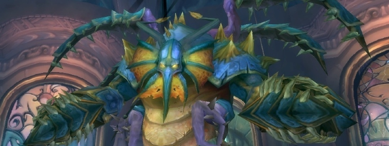
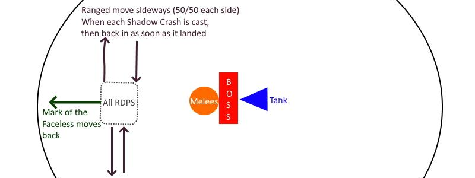

---
tags:
  - "Skippable: False"
  - "Difficult: Medium"
---

# General Vezax

## Overview

> Vezax is a Boss that is all about _twisting the usual game mechanics._

## Full Mechanics Rundown

* Vezax is flat out __Immune to Taunts__. It is recommended to not pull threat if you’re not a Tank.
* Once pulled, he will disable __ALL MANA REGENERATION__. That is MP5/Spirit from Items, from your base character, from potions, from Talents (e.g HPal’s Illumination), from Spells (e.g Divine Plea), everything. The only exceptions are Retribution and Enhancement getting a very minor help to sustain their mana, lest they would be utterly useless and benched, which wouldn’t be nice.
    * That aura also reduces melee attack speed by 20%, for reasons.
    * Due to this mechanic I encourage all Healers (MS and OS) to not destroy their old gear and to look after gear that has no MP5/Spirit. Paladins especially have a brilliant selection of items that give Haste+Crit, which is rarer on Cloth/Leather. Those specific items can be gemmed/enchanted differently, for instance with Spell Power gems on a HPal set since Intellect won’t be of much use. Similarly, a specialized Talent offspec/respec can be very handy.
* _You can actually regenerate mana in Normal Mode._ “Saronite Vapor” Adds will float around the room. They have low HP and are easily killed by cleave. When killed, they drop a green puddle below them.
    * <ins>Staying in the green puddle will regenerate Mana at the cost of their Health</ins>, doubling up for every 2 seconds remained in the puddle. The first tick is 100 mana at the cost of 200 health, the second 200mana/400hp, then 400mana/800hp, etc. __This Health loss can kill you__, so don’t die, especially since there are no mechanics to prevent movement (would be a great excuse).
    * __Healers should not rely on this mechanic, since it's disabled in Hard Mode.__
* He will regularly cast __Shadow Crash__ at a _random Player, preferring Ranged_ (in this case it is vital to have enough Ranged Players). The Shadow Crash is _a very slow-moving projectile but deals AoE high damage_ (60-80% HP) on impact, knocks any targets hit around, and leave a <ins>black puddle</ins> that grants the following to Players on it:
    * +100% Magic Damage dealt
    * +100% Casting Speed
    * Mana Costs -75%
    * Healing Done -75%
    * In other words, this is RangedDPS Heaven. They will have to constantly __dodge the regular Shadow Crashes__, <ins>move back in to benefit the massive buff</ins>, rinse and repeat. As you’d expect this is a huge DPS gain in spite of the movement, so extreme caution should be paid to __not pull threat off the (untauntable) Boss.__
* He will sometimes (45s cd) apply a debuff called __Mark of the Faceless__ _on a random Player, preferring Ranged_. The debuff causes no harm to the Player himself but will cause him to __do high damage every second to nearby allies (~15% max HP every 2 seconds). Every tick heals Vezax not for the same amount, but for 50k if he has a healing debuff (Mortal Strike/Aimed Shot), 100k if the debuff is missing.__ That’s a lot, so not only does it delay the Boss’ death greatly, but can also kill the Ranged Players that just want to sit in their Shadow Crash puddle. _The Marked Player should thus get away from the Raid A.S.A.P using Rocket Boots, Blink, Warlock Portal, or anything that helps getting out._ The Player himself won’t require Healing so he can run out regardless of his current Health if he keeps dodging Shadow Crashes - he’ll be safe.
* He will very frequently (8-10s cooldown) cast __Searing Flames, which must be Interrupted.__ If not, it deals huge (50-70%) Fire Damage to the whole Raid and reduces their Armor by 75%, certainly dooming the Tank and causing a wipe. <ins>Two Melee DPS should focus to rotate kicks to handle this</ins>, as they won’t be the primary DPS dealers in this fight. One Enhancement Shaman SHOULD be able to take all the kicks.
* He will buff himself every minute with __Surge of Darkness__ for 10 seconds, doubling his melee damage but also slowing himself down by half. Even on Hard Mode <ins>this can be tanked through with cooldowns</ins>, but keep in mind a _possible_ strat can involve kiting him during the Surge and repositioning the Raid further down the room. The downside of this strat is lower threat from the Tank while he moves.

## Strategy Image Reference

## Essentials

### Tanks

* Use cooldowns on Surge of Darkness and dish out as much Threat as possible.

### Healers

* __Practice saving your mana.__
* Discipline can stay in the Black puddle as Shields are not reduced by this aura.
* (Re-)Learn to cancel your casts if the Tank gets topped during your cast. Practice using externals on Surge, especially Hand of Sacrifice without dying.

### DPS

* __Have a very clear Threat meter on your UI. Seriously.__
* __Melee DPS must handle interrupts.__ Ranged DPS must do the least possible damage  to the Raid with Mark of the Faceless (preferably zero, as there’s a delay before the 1st tick). __Getting hit by a Shadow Crash is a big mistake and won’t be possible in hard Mode.__

## Special Assignments

Externals during Surge of Darkness.  

## Hard Mode

There is no hard mode for Ignis.

## Hard Mode

This boss has a hard mode for the fight. [Click here](../hard/vezax.md) to check its guide.
