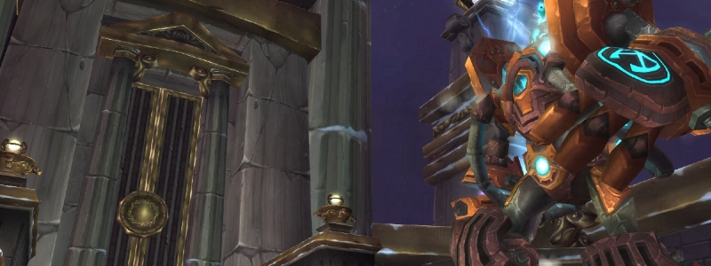

---
tags:
  - "Skippable: False"
  - "Difficult: Easy"
---

# XT-002 Deconstructor

## Overview

> XT-002 is a Boss that alternates between two Phases. In the first, he engages the Raid by himself. In the second, he takes increased damage and doesn’t fight, but summons Adds.

## Full Mechanics Rundown

* When active, XT will regularly place a Debuff on a random Player. He alternates between two Debuffs:
    * __Searing Light__ (“Light/White debuff”) causes heavy Damage over time to the Player and anyone near it.
    * __Gravity Bomb__ (“Black debuff/bomb”) causes nothing over the duration, but will detonate when the Debuff runs out, damaging the Player and his nearby allies while also vacuuming them into the Player’s position.

!!! note "Obs"
    The correct play in both cases is to not be near allies.

* When inactive, XT will technically be untargetable and instead plop down another NPC, <ins>his Heart, which takes +100% increased damage and carries over all the damage it takes</ins> to the “real” Boss’ HP.
__Destroying the Heart enables Hard Mode, so do not be confused if we ask you to stop DPSing.__ In the meanwhile he will stop applying Debuffs (though left-overs Debuffs might still continue to be dangerous when P2 begins) and instead summon Adds:
    * _Repair Bots_ will greatly heal him if they reach him. they can be crowd controlled, usually by Frost Nova or Elemental Shaman Earthbind.
    * __Bomb Bots__ are fragile and explode for Great damage on death, damaging both Players and nearby Repair Bots alike.
    * Pummelers __are strong Tank&Spank Adds__ that must be Misdirected to the Tank (possibly an Offtank) and killed when possible. They whirlwind but melees will survive the damage.

* After a while of Heart damage, P1 resumes. _XT begins a Heart Phase every time he loses 25% of his max HP, so Heart Phases can actually chain up very quickly if enough damage is dealt to the Heart__ - making the Normal Mode fight extremely trivial.

## Essentials

### Tanks

* Nothing except maintaining Threat on Boss and Pummelers.

### Healers

* __Focus heals on Searing Light debuffs - Your UI must be able to tell you who has it__, and fast.
* Deal some Damage during Heart Phases.
* If you have a Debuff, move out of the Raid accordingly to either side.  If the debuff is Searing Light, <ins>run through the least Players possible</ins> and instant cast heals on yourself.

### DPS

* Use DPS cooldowns on Heart Phases (I doubt we’ll have too much dps on day 1)
* If you have a Debuff, move out of the Raid accordingly to either side.  If the debuff is Searing Light, <ins>run through the least Players possible</ins> and use healthstones/def cds.

## Special Assignments

Hunter MDs  
Crowd Control on Repair Bots if needed

## Hard Mode

This boss has a hard mode for the fight. [Click here](../hard/xt002.md) to check its guide.
