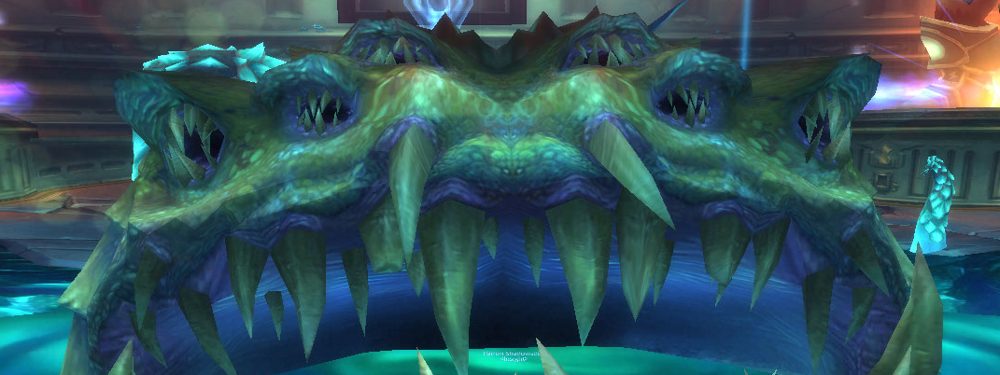
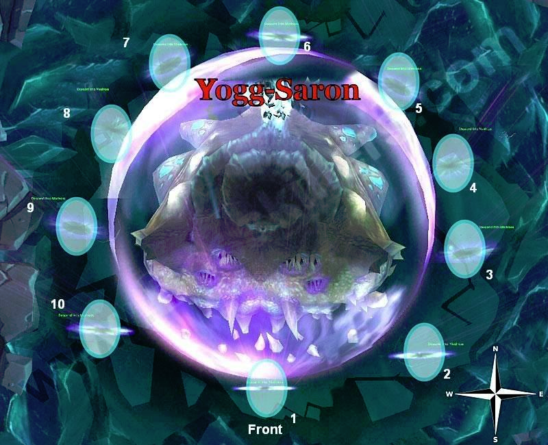

---
tags:
  - "Skippable: False"
  - "Difficult: Easy"
---

# Yogg-Saron

## Overview

> Yogg-Saron is a 3-Phase fight

## Full Mechanics Rundown

### Keepers

The Keepers of Ulduar (aka Thorim, Hodir, Freya, and Mimiron) are very grateful for breaking Yogg’s mind control on them and will assist the Raid in the encounter with Yogg. They must prealably be talked to, to activate their help. __This cannot be undone.__

Each Keeper provides his own, large Buff to stats on the Players (which never expires), and provides a useful ability to change the fight:

* Mimiron grants +10% Damage dealt and +20% movement speed. He will also massively reduce the casting speed of enemy Adds in Phase2 (will be detailed later)
* Hodir grants +10% Damage dealt and -20% Damage taken. He also will prevent some Player deaths by encasing them in an ice block, saving their life. This has a cooldown and the Player may “/cancelaura Flash Freeze” if he’s safe and wishes to exit the ice block early.
* Thorim grants +10% Damage dealt and +20% max HP. He will also regularly execute Adds in Phase3, that would otherwise be immortal, if they reach low HP.
* Freya will grant +10% Damage dealt and +20% Healing received. She will also enable 4 Sanity Wells in the corners of the room, large green beams that reduce damage dealt while standing in it but restore Sanity.

### Sanity

__Sanity is a “resource” that will be displayed in a form of a Debuff on your UI__. <ins>It goes from 100 to 0.</ins> The only direct effect it has is that if you reach 0 Sanity you will be __mind-controlled__ by Yogg-Saron, gaining massively increased stats and becoming very mean to your Raid. __The Mind-Control will never be undone including by Battle Rez, Soulstone, and Ankh (So do not do any of these on a previous Mindcontrolled Player/on yourself if mindcontrolled).__ It is not necessarily a wipe sentence but shows you fucked up.  
So, back to Freya’s Sanity Wells: Simply stand on it to regenerate 20 sanity every 2 seconds. That’s it. Very fast, safe, and available in all Phases of the fight.  
When a Boss’ mechanics interacts with Sanity it’ll be reminded in the writeup. In general, you can assume the following: All damage that is avoidable in Phase2 and 3 will likely also have a small damage to Sanity.

### P1

Yogg will pretend to be Sara. To snap him back to his reasonable self, we have to damage Sara in the middle of the room, but it’s a friendly NPC. What to do?

* __Ominous Clouds__ will float around the room. Their path isn’t random: They are placed on _concentric circles and turn clockwise or counterclockwise_. Stepping on a cloud will cause a Guardian of Yogg-Saron to appear after a few seconds. Guardians of Yogg-Saron also spawn over time regardless of Cloud-stepping experiences.
* Guardians of Yogg-Saron do moderate melee damage (clothies beware) and cast __Shadow Volleys__ (high damage, and reduce healing recieved) which should always be <ins>interrupted</ins>. __When they die, they also instantly cause a Shadow Nova__, dealing heavy but healable damage (as long as not too many die at the same time). Apparently Silencing the Guardians or Interrupting a Shadow Volley before they die prevents them from doing a Shadow Nova, which is probably an exploit and is not necessary anyway.
    * The Shadow Nova damages Sara (if in range) for 12.5% max HP. So, bring 8 Adds to the middle, kill them here, and Phase2 begins. Sounds great, but:
* Sara herself will cast a few spells that might cause trouble:
    * __Sara’s Fervor__ is a debuff that increases a Player’s Damage by 20% but __causes him to take +100% Damage.__ This might be enough to cause the Player to be __one-shot__ by a Shadow Nova when an Add dies. The Player should move out of the stacked Raid while ensuring to not step on clouds. Daddy Hodir might save you from the one-shot but this is necessary practice for Hard Mode.
    * Sara’s Blessing is a debuff that causes 60K Shadow Damage over 20 seconds. In itself it’s mostly harmless and healable through, __but can stack with Sara’s Fervor, becoming near-lethal damage when added on top of Shadow Novas__. Players should use defensive cooldowns like Anti-Magic Shell or Ice Block if receiving both debuffs.
    * Sara’s Anger is used on Guardians of Yogg-Saron rather than Players and increases their melee damage per swing by 12000. Unremarkable.

### P2

<ins>Transition</ins>: The Ominous Clouds will disappear but Adds will remain, usually 1  + 1 extra that is about to spawn. <ins>Simply pull the Raid out of the center and keep killing the Adds the same way.</ins>  
Yogg will show up in the center of the room (what once was a large puddle of saronite), pushing Players away if they try staying too close to his godly corpulence. _He’s immune to damage in this Phase._

Now, onto Phase2 itself:

* As soon as Phase2 begins, __several Tentacle Adds__ will spawn all around the room in random patterns. _More Tentacles will also continuously spawn_ until the Raid manages to push Phase3. _They are all stationary._ The three types of Tentacles are the following:
    * __Corruptor Tentacles__ constantly cast __Debuffs__ at random Players. All their casts can be <ins>Interrupted</ins>, and Mimiron’s presence causes them to cast 4x slower. There are 4 different debuffs (Curse, Poison, Magic, Disease) and __all should be dispelled as soon as noticed on your UI.__ Ranked in order of danger:
        * _Disease (regularly stuns) > Magic (heavy slow) > Poison (HP/Mana DoT) > Curse (Curse of Doom, 12s duration)_
        * Corruptor Tentacles are the <ins>lowest priority</ins> to be killed among the 3 types.
    * __Crusher Tentacles__ reduce the Raid’s Damage by 20% (for each Crusher, can stack) as long as they are not being hit by melee swings. However, they also __can one-shot with their melee swings__ (if any Player is in melee range). It is not necessary for melees to risk their lives on the Crushers, <ins>the Ranged DPS can take care of them. All Paladins should be using Judgements on Crusher Tentacles whenever it’s up, as it is classified as a melee attack and will interrupt Diminish Power (the -20% Damage reduction)</ins>
        * Crushers are the <ins>second in priority</ins> to be killed.
    * __Constrictor Tentacle__ will spawn near a Player and grab it, preventing its movement and causing heavy Physical damage over time. It has fairly low HP and should be <ins>focus-fired instantly when it spawns.</ins>
        * _Immunity effects like Iceblock, Bubble and Hand of Protection should also free the grabbed Player - seemed inconsistent last season._
* Sara becomes a very attractive Val’kyr, proving Yogg has schizophrenia. She will cast the following spells to disrupt the Raid, ranked from most dangerous to least:
    * __Death Ray__: Several lasers firing in semi-random patterns, usually edging towards Players. Two/three ticks are lethal and they tick very fast, thus should be stood away from as much as possible.
    * __Malady of the Mind__: Cast on a random Player and behaves as a Warlock’s Death Coil. __At the end of the effect, it will bounce to a nearby Player(if any is nearby).__ Everyone should be wary of that and move away from any Malady’d Player, which will be marked with Skull by DBM. The Malady deals low damage but reduces Sanity.
    * __Brain Link__: Two Players will be bound by a link that forces them to go close to each other. If the Players are over 20 yards away from each other they will take damage and lose Sanity. The link will be red if that is the case.
    * Psychosis: Random unavoidable damage on a Player, also reducing Sanity.
* __Induce Madness__: One minute after transition, this mechanic will begin on a cycle.
    * Every time Induce Madness is cast, <ins>10 Portals will open around Yogg</ins>. Their positions are fixed and they will be assigned to Players. <ins>Those Players should be ready in front of their assigned portal before they’re active.</ins>
    * Clicking on the Portal leads to a __Brain Room__, of which three are possible. The layout changes but the same rules apply:
        * The Players in the Brain Room must move to <ins>eutral NPCs and destroy them</ins>. __They will reflect % of incoming damage__, justifying the presence of a Healer among the 10 Players.
        * While doing so, __they must avoid facing__, (their character, not the camera…) as much as possible, __the light-purple laughing skulls__. Facing them causes damage and reduces Sanity.
        * Once all NPCs have been destroyed the laughing skulls will be removed and a wall of the room will be removed. Proceed through it to find __the Brain of Yogg-Saron__, which is the actual caster of Induce Madness. The Brain can be damaged, doesn’t fight back in any way, <ins>and all damage done to the Brain will carry over to Yogg himself</ins>. Damaging the Brain is the only way to make Phase3 happen. <ins>_As long as the Brain is exposed, all Tentacles will be stunned and no more will spawn.</ins>_
        * Near the Brain some Portals will allow the trip back to the main room. __Should any Player remain in the Brain Room when Induce Madness completes casting (It’s a 60s cast), they will instantly be lowered to 0 Sanity and be Mind Controlled.__ The Brain Room should be left with a generous 2-3 seconds remaining before the end.
        * 30 seconds after Induce Madness completes, a new Induce Madness will be cast and Portals will open, rinse and repeat.
* Once Yogg-Saron reaches 30% HP due to Brain damage (heh), Phase3 begins.

### P3

Yogg decides to stop messing about and remembers he’s supposed to be a God of Death and not of Tentacles of Brains, and engages the Raid directly.  
He’s still stationary and will still bump out any Players in him. He does not melee.
<ins>Leftover Tentacles from Phase2 will not be removed</ins> and should either be dealt with or ignored, at the discretion of the RL.  

* He will cast __Lunatic Gaze__ extremely frequently on a fixed cooldown. Anytime Lunatic Gaze is being channeled, __any Player that faces towards Yogg will take damage and lose a large amount of Sanity__, every second. While Lunatic Gaze isn’t being cast, it’s back to normal.
* __Immortal Guardians__ will spawn very frequently, in various corners of the room, sometimes very close to Players. They deal __high melee damage__ (enough to OS a clothie) and should be picked up A.S.A.P. However, they deal less damage (and become smaller) as their %HP is lowered. They will attempt to cast __Drain Life__ to heal back up (and even when full HP), which should be <ins>interrupted</ins>.
    * As mentioned earlier, the Immortal Guardians are Immortal, but Uncle Thorim got your back and out-mortals them by _finishing them_ off when they reach 1% HP.
* Yogg-Saron will sometimes apply __Shadow Beacon__ to a random Immortal Guardian. After a few seconds, the Shadow Beacon, if still alive, will apply a huge Heal over Time to its nearby allies - either other Immortal Guardians or Yogg-Saron. _This is not a concern in Normal Mode and will be expanded upon in the Hard Mode section._

## Strategy Image Reference

## Essentials

### Tanks

* P1
    * Pick up Adds and keep them in the center of the room.
* P2
    * There’s nothing to Tank! Do your best to <ins>Interrupt</ins> the Corruptors and Judgement the Crushers (if Paladin) and <ins>Dispel</ins>.
    * Regenerate Sanity in the Sanity Well if needed.
* P3
    * Pick up Adds while facing away from Yogg. Interrupt their Drain Life.

### Healers

* P1
    * Focus heals <ins>on debuffed targets</ins> and patch the Raid to full between each Add dying.
* P2
    * Priority: Healing someone who’s about to die literally in the next GCD > *__Dispels__* >>>>>>>>>>>>>>>> Any other kind of Healing.
    * Hpals should Judgement Crushers whenever it’s off cooldown.
    * Healer assigned to Brain Room (likely Druid or Discipline) must keep moving and blanket the Raid will facing away from skulls.
    * Regenerate Sanity in the Sanity Well if needed.
* P3
    * Face away from Yogg at all times, as none of your spells require facing an enemy. Focus heals on the Tank, as the Raid should not take any noticeable damage.

### DPS

* P1
    * <ins>Interrupt Adds</ins> anytime and stay stacked with the Raid.
* P2
    * Ranged on Crushers, Melees on Corruptors with Interrupts. Constrictors instantly become #1 priority when they spawn.
    * Brain Room saves cooldowns for the Brain itself and must regenerate their Sanity in the Sanity Well if needed.
* P3
    * Melees should cleave Adds and only turn on Yogg-Saron if no Adds remain. Ranged should always be on Yogg-Saron unless Adds start overwhelming the Raid. Neither DPS should be facing Yogg more than 1 tick of Lunatic Gaze. Warlocks and Shadow Priests should turn away whenever channeling a Drain Soul or Mind Flay.
    * Regenerate your Sanity in a Sanity Well if needed.

## Special Assignments

One DPS will be tasked to deal a large amount of Damage in a single blow on Brittle Adds when they enter the water. Mages or Hunters are good candidates for it, though other classes can apply.

## Hard Mode

This boss has a hard mode for the fight. [Click here](../hard/yogg.md) to check its guide.
