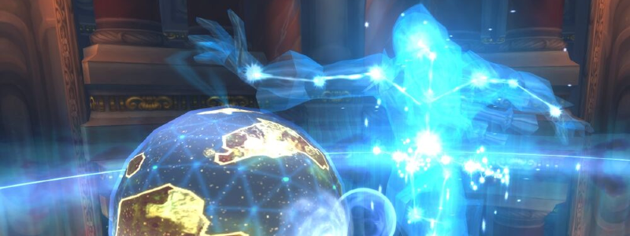

---
tags:
  - "Skippable: True"
  - "Difficult: Very Hard"
---

# Algalon the Observer

## Overview

> Algalon can only be accessed through a chain of quest that involves beating Iron Council HardMode, then all 4 Keepers Hard Mode (in any order and not necessarily in the same week). Doing so completes a key that will be usable any week (and in both 10 and 25) to open the door to Algalon. It can be accessed as early as after XT-002’s fight.  
> Once Algalon is pulled for the first time of the week, a 1-hour timer begins. Algalon will instantly vanish once the timer runs out, including if during a fight, leaving for the whole week. Technically Azeroth gets destroyed if he leaves but don’t worry about that too much.
> Slacking between pulls is therefore extremely ill-advised. The fight is fairly short so even one minute can mean the difference between one more pull and having to Raid Off.
> Algalon has two Phases, of which the second is fairly short and somewhat a simplified Phase1. You may not relax and expect less reading than Yogg.
> Algalon is, all in all, a fat gear/performance check, and the burden of the strat is mostly on the Tanks.

## Full Mechanics Rundown

* __Algalon deals massive Tank damage__, like real massive, one might even call it Supermassive. He dual wields, has high damage per swing, also uses Quantum Strike very frequently, which is sort-of a Sinister Strike (instant melee damage with no other effects). Healers will obviously be under pressure to keep the Tanks full nonstop, pre-cast heals even on 100% HP tanks and use externals just because. Tanks will weave cooldowns anytime they wish.
* Speaking of Tanks, Algalon also frequently applies a <ins>Phase Punch</ins>, dealing moderate damage and applying a stack. __If a Tank reaches 5 stacks he will disappear to the Shadow Realm__, which doesn’t mean death but will cause Algalon to simply switch threat to the #2. The Tanks should simply <ins>taunt swap</ins> at 3 or 4 and ensure they can remove their stacks (45s duration) without receiving threat again.
* Algalon will cast a few __Cosmic Smashes__ through the fight. This behaves similarly to several __Shadow Fissures__ on random Players which will need to be <ins>moved out of</ins>. Can target the Tank. _Players still take damage when the Cosmic Smash lands after the delay, scaling down with how far they are_. Unlike the Shadow Fissures, the Cosmic Smash doesn’t instantly kill but instead deals very heavy damage and knocks up in the air, causing death if unable to cancel the fall damage.
* __Cosmic Smashes__ obviously will simply need to be <ins>moved out of</ins>. Their damage (when moved out of) is fairly low but can actually _add up to be lethal with other mechanics_.
* Algalon will summon 4 <ins>Collapsing Stars</ins>, roughly in the 4 corners of the room. These do nothing of their own but will need to be killed to survive the rest of the fight. <ins>They have low HP and can be dealt with by a single assigned DPS</ins>. When they die, __they deal massive, Raid-wide Shadow Damage__. DSacs and Shadow AMs (rotating) will be mandatory to survive the encounter. _The damage is so high we might need Mages to respec to some points in Magic Absorption_.
    * <ins>Fixing this damage fast enough to kill enough Stars is the second priority for Healers</ins>.
    * When the Stars die, they also leave <ins>a Black Hole that teleports to the Shadow Realm if stood on</ins>. __Everyone should stay clear of Stars that are currently being killed.__ They wander around but otherwise do not follow anyone.
    * Stars also lose some Health over time and thus cannot be ignored, as they would uncontrollably all explode at once (or too fast, at least).
    * There can be 3 waves of Collapsing Stars, preferably 2, before Phase2 is enabled.
* Algalon will summon <ins>Living Constellations</ins>. Unlike Stars, _these have a normal Threat table and will follow their target_. They do not melee swing but instead regularly cast __Arcane Barrage__ at random Players, dealing moderate damage but enough to be _lethal if combined with a Star Explosion and/or a Cosmic Smash_.
    * The Constellations realistically cannot be DPS’d and should not. <ins>Instead, they disappear when coming in contact with the Black Holes left by the Stars upon death, “closing” the portal therein</ins>. The ground becomes safe again and the Constellation stops damaging the Raid. There are several Constellations and they should be used to close as many Portals as possible, __except one__ (see __Big Bang__ below).
* Every 90 seconds Algalon will cast __Big Bang__, which does not create life as it should but instead obliterates it. The Raid’s desire to not die should drive them to __enter a Black Hole/Portal to the Shadow Realm before the Big Bang cast is complete__. Be mindful the Portal <ins>should be entered 2-3 seconds before Big Bang is done, rather than later</ins>, or you’ll be locked out from entering. 
    * __Algalon will hard-enrage if all Players leave to the Shadow Realm__. Therefore, one brave Shadow Priest will stay behind and use <ins>Dispersion</ins> to let the fight go on.
    * Tanks can survive with cooldowns but they are better used during the actual fight.
* <ins>Shadow Realm</ins>: This is how the Shadow Realm behaves for the whole fight, but obviously this applies mostly to entrances to it due to Big Bang.
    * The Shadow Realm doesn’t really have much to offer. There will be Dark Matter Adds that merely swing at their current threat target - <ins>they aren’t very dangerous but can overwhelm a single, non-Tank Player</ins>.
    * <ins>Leaving the Shadow Realm is automatic after a few seconds</ins>. It does not depend on the completion of the Big Bang. Therefore a Tank (usually the Offtank that was leading the Constellations to the Black Holes) should ensure he jumps in first and early.
    * __When you leave the Shadow Realm, you will appear on the same spot in the “Main Room” as the one you stood upon in the Shadow Realm__. If that spot is a Black Hole, then off you go to another trip to the Shadow Realm. This is bad and should be avoided by having the general rule of running to the center of the room whenever in the Shadow Realm (assuming there are no Black Holes in the center). This rule will be useful for Phase2.

The fight will usually go like this: Pull -> Stars and Constellations -> Big Bang -> Stars and Constellations -> Big Bang -> Stars and Constellations appear but Phase2 is pushed so Adds are ignored.

Phase2, indeed, is pushed when Algalon reaches 20% HP. When he does, all Black Holes will be closed, and all Stars and Constellations will safely disappear. No more of these will spawn.

* __The Raid must move to the center of the room before he is Phased__, as Algalon will also _instantly place 4 stationary Black Holes that cannot be closed_ (having Players on top of them would be bad!). These Black Holes will spawn _Dark Matter Adds_ (same as the ones in Shadow Realm) that can mostly be ignored and offtanked.
* Algalon will continue to cast __Cosmic Smash__. With the reduced room to maneuver extra caution should be paid to spot them and move out.
* Algalon will, in all likeliness, __cast one more Big Bang__ before the fight ends. The Black Holes are nearby and reaching them should be no trouble. As advised, the <ins>Shadow Realm Players should move back to the center of the room</ins> to ensure they do not instantly get ported back in.
* __Algalon seems to always Cosmic Smash after that last Big Bang, and the particles will be hard to see__ upon leaving the Shadow Realm. <ins>Players should move the hell out of the center since it is assumed all Players will be in the center, and thus that the Cosmic Smashes will target the center. Casualties will be accepted here</ins>.
* Upon reaching near-death Algalon will end the encounter and award loot to us pitiful mortals.

## Essentials

### Tanks

* Use cooldowns whenever you’re tanking Algalon and a star is about to die (Algalon himself deals somewhat consistently high damage so you might as well use your CDs when a bit more damage will be caused by the Star).
* When __Big Bang__ is coming up soon, __Algalon should be moved slightly close to the last Black Hole, so that the Raid may do a few seconds worth of DPS before leaving safely.__ Obviously, you gotta get in too unless otherwise specified.
* <ins>While baiting Constellations into Black Holes watch your movement to not enter the Black Hole</ins>. HPals really should be allowed to use Righteous Fury on this fight so keep in mind you’ll likely have to <ins>taunt it off them</ins>.
Taunt swap depending on the situation. Sometimes swapping at 2 is OK depending on which classes the tanks are, their cooldowns, etc. Be careful on the Tank swap as Algalon seems to have volatile threat and sometimes __returns to the previous Tank__ because of the DOTs he might have.
* Never lead a Constellation into the last Black Hole that the Raid wants to use to enter the Shadow Realm. __If you find yourself in such a situation where a Constellation sticks to you during a Big Bang, you must be the last to enter in the Black Hole.__ (as moving into the Black Hole would close it due to the Constellation)

### Healers

* Pump hard and ensure the Raid is full HP for each Star dying. Pre-cast on the Tank nonstop.
* When Big Bang happens, and if Algalon is positioned correctly, <ins>Hpals should instantly Divine Plea (as no healing is required here) and melee Algalon for 2-5 procs of Seal of Wisdom, before leaving safely.</ins> This _makes_ a difference.
* Do your best to respect the cooldown rotation for the Black Hole explosions but if shit happens just postpone it for another explosion, as it is likely the second set of Stars might happen too early for DSacs to end their cooldown.
* If a Living Constellation sticks to you, <ins>try moving to the Offtank or slightly close to a Black Hole</ins> while keeping the Main Tank and the Raid full. It helps a lot.
* __It is near-guaranteed that on the second Big Bang, there will remain one Constellation that cannot be removed since only one Black Hole remains.__ If this Constellation sticks to you, you must be the last Player to enter the Black Hole. _If you enter too early the Black Hole will close and anyone who expected to enter after you will die._
* Any defensive CDs your class offers should be used on the upcoming death of Collapsing Stars, especially for the later ones where Living Constellations also cause random damage to the Raid.

### DPS

* This is a DPS check but obviously must not cause you to neglect your safety: Move out of __Cosmic Smashes__, of __Collapsing Stars that are about to die__, and <ins>move to the center of the room when in the Shadow Realm</ins>.
* __Do not DPS/Cleave/Multidot AT ALL, unless instructed to, on the Collapsing Stars__.
* Padding DPS on Algalon before escaping the Big Bang is a necessity, but leave a margin of 2 seconds at least.
* Ranged should spread so that Cosmic Smashes cause the lowest amount of Players to move. Similarly, Melees should stick to one side and move to the other if Cosmic Smash aims on their camp. The Tank might instead pull Algalon out a bit to allow you to continue DPSing by just moving forward.
* <ins>Any defensive CDs your class offers should be used on the upcoming death of Collapsing Stars</ins>, especially for the later ones where Living Constellations also cause random damage to the Raid.
* The last Big Bang goes: Some DPS -> Enter a Black Hole -> Move to the center of the room -> Move out of the center when you’ve been removed from the Black Hole.

## Special Assignments

Usually a Hunter (good execute, can control his damage, is mobile) or a Demolock (procs Decimation which carries over DPS on Algalon) will be assigned to kill Stars by himself, preferably one that can communicate on the status of the Star’s HP. DBM should regardless be telling you when Stars are about to die.
